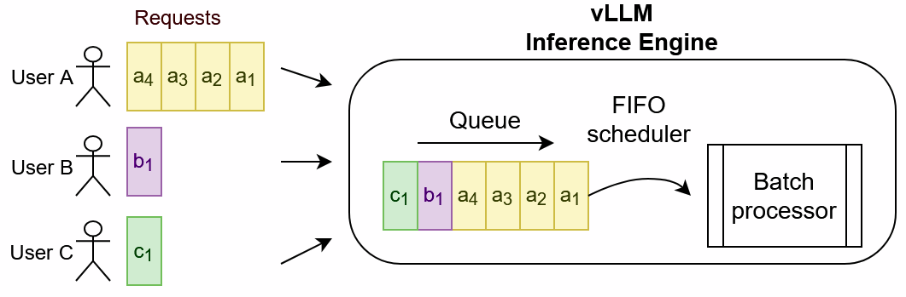
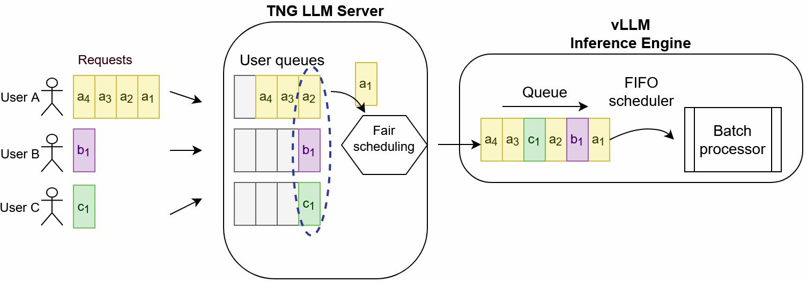
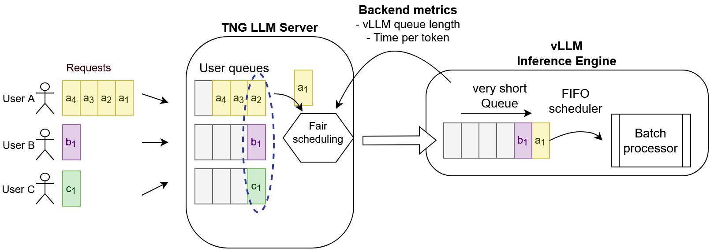
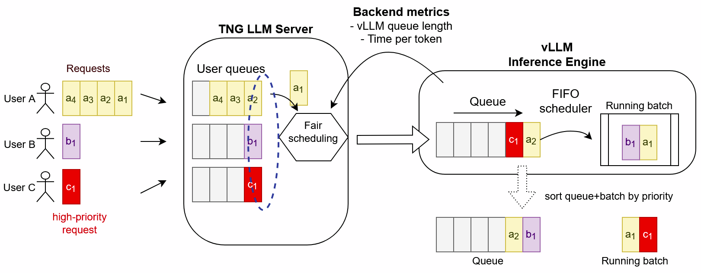

# Efficient Request Queueing – Optimizing LLM Performance
高效的请求排队 – 优化 LLM 性能

* https://huggingface.co/blog/tngtech/llm-performance-request-queueing

Serving LLMs to many applications and users in parallel is challenging because they compete for limited GPU resources. This article is the first in a series on LLM performance, based on our experience with serving self-hosted LLMs at TNG Technology Consulting GmbH. In the first part, we focus on the impact of queuing and discuss different scheduling strategies.
并行地为多个应用程序和用户提供 LLM 服务极具挑战性, 因为它们会争用有限的 GPU 资源. 本文是基于 TNG Technology Consulting GmbH 提供自托管 LLM 服务的经验而撰写的 LLM 性能系列文章的第一篇. 在第一部分中, 我们将重点讨论排队的影响, 并探讨不同的调度策略.

### Starting Point: A Bare Inference Engine
起点: 一个裸推理引擎

An inference engine like [vLLM](https://github.com/vllm-project/vllm) or [HuggingFace TGI](https://github.com/huggingface/text-generation-inference/) consists of
像 vLLM 或 HuggingFace TGI 这样的推理引擎由以下部分组成:

- a worker that does the actual work of calculating the next token in a request
  一个负责计算请求中下一个 token 的实际工作进程

- a queue to which requests are added when they first arrive
  请求到达时会被添加到队列中

- a scheduler that takes requests from the queue and moves them to the worker
  调度器从队列中获取请求并将其分配给工作进程

Why do we need a queue here? Because calculations on the GPU are more performant and resource-efficient when they are done batch-wise instead of isolated for individual requests. This backend queue allows the scheduler to pick multiple requests and put them on the same batch to be processed.
为什么这里需要队列? 因为 GPU 上的计算如果以批处理方式进行, 比单独处理单个请求更高效、更节省资源. 这个后端队列允许调度器选择多个请求, 并将它们放入同一个批次中进行处理.

Note that typically each inference engine serves only a single model, and we have multiple deployments running for different models in parallel.
请注意, 通常每个推理引擎只服务于一个模型, 而我们有多个部署并行运行, 用于不同的模型.

### Problem: "Power Users" Can Block Other Users
问题: "高级用户"可以屏蔽其他用户

When a single user "A" sends a large number of requests, they will quickly fill up the queue. Other users ("B" and "C") that send their requests only shortly after are blocked from using the same model (until all requests from "A" have been processed). Note that the picture focuses on vLLM as inference engine, but the problem is more general and applies to other backends as well.
当单个用户"A"发送大量请求时, 队列会迅速被填满. 其他用户("B"和"C")在"A"之后不久发送请求, 将被阻止使用同一模型(直到"A"的所有请求都被处理完毕). 请注意, 图中重点展示了使用 vLLM 作为推理引擎的情况, 但该问题更具普遍性, 也适用于其他后端.

### Solution: Fair Scheduling
解决方案: 公平排班

At TNG, users don't send requests directly to the vLLM backend but to an API Server (what we call "LLM-Server"). Here we can have separate queues for each user (and model), and a scheduler that is not FIFO (first in - first out) but goes round-robin through all user queues. This achieves some **"fair scheduling"**: for example, in the diagram users B and C send their request a bit later, when user A's first request has already been scheduled. At that time, three requests from user A had been waiting already for some time, but user C has to wait for only one request from user A to be completed.
在 TNG 系统中, 用户并非直接向 vLLM 后端发送请求, 而是向 API 服务器(我们称之为"LLM 服务器")发送请求. 在这里, 我们可以为每个用户(以及模型)设置独立的队列, 并使用一个并非先进先出(FIFO)而是轮询(round-robation)的调度器来遍历所有用户队列. 这实现了一定的公平调度: 例如, 在图中, 用户 B 和 C 的请求发送时间稍晚, 此时用户 A 的第一个请求已被调度. 此时, 用户 A 的三个请求已经等待了一段时间, 而用户 C 只需等待用户 A 的一个请求完成即可.

The key idea is: prioritize requests from different users in our own component and not in the inference backend! Typically, you can't change the order of requests once they have been sent to the inference engine, so you have to bring them in the right order while they are still in the LLM-Server, where we have full control.
关键在于: 在我们自己的组件中, 而不是在推理后端, 对来自不同用户的请求进行优先级排序! 通常情况下, 一旦请求被发送到推理引擎, 就无法更改其顺序, 因此必须在请求仍在 LLM 服务器中时就将其排序, 因为我们可以完全控制服务器的运行.

#### Possible Extensions
可能的扩展

You can consider different aspects in order to decide what "fair" scheduling is. In the above example, any new user with a single request should be served before any user is served two or more times in a row. This is "fair" on a number-of-requests level. But you could also look at **processing time**: how long does a request keep the backend busy? Long prompts and long generations will "block" the LLM for other users for a longer time, so maybe shorter requests should have precedence? Unfortunately, it is very difficult to estimate the generation length. While there are some requests with a "max_tokens" limit, a typical chat message from an interactive AI assistant has no token limit, and can vary between a very short generation ("summarize this text") and a very long one ("tell me a story" / "write all code for xyz").
为了确定何为"公平"的调度, 您可以从多个方面进行考虑. 在上述示例中, 任何新用户只要提交一个请求, 就应该优先于任何连续提交两个或两个以上请求的用户. 从请求数量的角度来看, 这算是"公平". 但您也可以考虑处理时间: 一个请求会占用后端多长时间? 冗长的 prompt 和冗长的生成过程会"阻塞"LLM(生命周期管理)更长时间, 从而影响其他用户的访问, 因此或许应该优先处理较短的请求? 遗憾的是, 生成时长很难估计. 虽然有些请求有"max_tokens"限制, 但来自交互式 AI 助手的典型聊天消息没有 token 限制, 其生成时长可能从非常短的("总结这段文本")到非常长的("给我讲个故事"/"编写 xyz 的所有代码")不等.

Depending on the prompts, there can be some benefit in arranging requests based on similarity, so that vLLM can **maximize cache hits**, which speeds up the performance. This kind of KV-cache-aware routing has recently gained attention by frameworks like [NVIDIA Dynamo](https://github.com/ai-dynamo/dynamo) and [AIBrix](https://github.com/vllm-project/aibrix/).
根据 prompts, 基于相似性对请求进行排序可能带来一些好处, 这样 vLLM 可以最大限度地提高缓存命中率, 从而提升性能. 这种基于键值缓存的路由方式最近受到了 NVIDIA Dynamo 和 AIBrix 等框架的关注.

In a business context, and for hosted LLMs, the **cost** of individual requests can be another metric to consider, but comes with similar challenges.
在商业环境中, 对于托管的 LLM 而言, 单个请求的成本可能是另一个需要考虑的指标, 但同时也面临着类似的挑战.

The solution can also be extended by having not only one queue per user (and model) but **several queues with different priorities**. For example, interactive applications like [TNG's AI Assistant](https://taia.tngtech.com/welcome) with chat interface should have higher priority because users who don't see any progress within five seconds will think the application is broken. Users who generate code reviews for tens of files and several thousand lines of code, however, will expect the LLM requests to take some time. And some use cases (like benchmark runs, scheduled via a batch API) should have such low priority that they don't disturb other use cases and are just scheduled when nothing else is running.
该解决方案还可以通过为每个用户(和模型)设置多个优先级不同的队列来扩展. 例如, 像 TNG 的 AI 助手这样带有聊天界面的交互式应用程序应该具有更高的优先级, 因为如果用户在五秒钟内看不到任何进展, 他们会认为应用程序出现了故障. 然而, 对于那些需要对数十个文件和数千行代码进行代码审查的用户来说, 他们会预期 LLM 请求需要一些时间. 此外, 某些用例(例如通过批处理 API 调度的基准测试运行)应该具有极低的优先级, 以免干扰其他用例, 并且只在没有其他任务运行时才进行调度.

### Problem: No Backpressure by Backend Queue
问题: 后端队列没有施加背压

Consider again the scenario that one user A sends a lot of requests at once, and some time later a new user C joins and wants to schedule a single request. If the scheduler on LLM-Server side sent every request (according to the fair prioritization) immediately to the backend, all requests from A would accumulate again in the FIFO queue. The new user C would have to wait again until all previously received requests have been processed. There would be almost no improvement to the initial scenario without LLM-Server.
再次考虑这样的场景: 用户 A 一次性发送大量请求, 一段时间后, 新用户 C 加入并想要调度一个请求. 如果 LLM 服务器端的调度器按照公平优先级立即将所有请求发送到后端, 那么来自 A 的所有请求将再次在先进先出 (FIFO) 队列中累积. 新用户 C 必须再次等待, 直到之前收到的所有请求都被处理完毕. 如果没有 LLM 服务器, 这种情况几乎没有任何改善.

Ideally, you could limit the number of maximum elements in the backend queue, but vLLM doesn't give you that option. Therefore, we have to dynamically adjust the rate at which the scheduler on LLM-Server side sends new requests to the backend. Here, our goal is: **keep the backend queue length short** in order to minimize latencies experienced by new users.
理想情况下, 您可以限制后端队列中的最大元素数量, 但 vLLM 并未提供此选项. 因此, 我们必须动态调整 LLM 服务器端调度器向后端发送新请求的频率. 我们的目标是: 保持后端队列长度较短, 以最大限度地减少新用户遇到的延迟.

(The simplest approach would be a static rate limit, but this would likely result in underutilization when most requests are short and hard to calibrate for different models and load patterns).
(最简单的办法是设置静态速率限制, 但这可能会导致资源利用率不足, 因为大多数请求都很短, 而且很难针对不同的模型和负载模式进行校准).

### Solution: Fetch Metrics
解决方案: 获取指标

In order to make the backend queue length available in the LLM-Server, we need to fetch the respective Prometheus metrics from the vLLM /metrics endpoint. Our fair scheduler is only allowed to send requests to the backend as long as the **backend queue length metric** is smaller than three, for example. This target length for the backend queue can be lowered for an even shorter latency for new users, until it results in under-utilized batches and a reduced efficiency - there is a trade-off. Keep in mind, though, that the target queue length does NOT reflect maximum concurrency; there can still be more than three requests being processed in parallel; vLLM will add queuing requests to the current batch as soon as there is sufficient space ("continuous batching").
为了在 LLM 服务器中获取后端队列长度, 我们需要从 vLLM 的 `/metrics` 端点获取相应的 Prometheus 指标. 例如, 只有当后端队列长度指标小于 3 时, 我们的公平调度器才能向后端发送请求. 为了进一步缩短新用户的延迟, 可以降低后端队列的目标长度, 但这样会导致批次利用率不足和效率降低 – 这需要权衡. 不过, 请注意, 目标队列长度并不反映最大并发量; 仍然可以同时处理超过三个请求; 一旦有足够的空间, vLLM 就会将排队的请求添加到当前批次中("连续批处理").

#### Possible Extensions
可能的扩展

Once you have the feedback loop between backend queue and scheduler in the LLM-Server, you can easily extend the set of vLLM metrics used for making scheduling decisions. For example, for a good user experience in TNG's interactive AI Assistant we aim for a high token generation speed (e.g., >7 tokens/s, that is ~150ms per token), and if the reported **time-per-output-token metric** rises above 150ms, no new requests will be scheduled.
一旦在 LLM 服务器中建立了后端队列和调度器之间的反馈回路, 就可以轻松扩展用于制定调度决策的 vLLM 指标集. 例如, 为了在 TNG 的交互式 AI 助手中获得良好的用户体验, 我们力求实现较高的 token 生成速度(例如, 每秒生成 307 个 token, 即每个 token 约 150 毫秒), 如果报告的每个输出 token 的耗时指标超过 150 毫秒, 则不会调度任何新的请求.

You can also program **different metric thresholds for different request priorities**. For example, for low-priority requests from the batch API we only schedule a request when the backend queue is completely empty: we rather risk short periods of underutilized GPUs than causing increased latencies for any later request with higher priority.
您还可以为不同的请求优先级设置不同的指标阈值. 例如, 对于来自批量 API 的低优先级请求, 我们仅在后端队列完全为空时才安排请求: 我们宁愿承担 GPU 短时间利用率不足的风险, 也不愿导致后续高优先级请求的延迟增加.

There is quite some potential for optimizations: for example, if you allow scheduling for a backend length shorter than three and the current metric is zero, you can immediately send three requests to the backend before having to fetch the metrics again. In the worst case, none of them fit into the current batch and all of them are in the backend queue (in which case the new length is three, just fine).
这里还有很大的优化空间: 例如, 如果允许后端请求长度小于 3, 且当前指标为零, 则可以立即向后端发送三个请求, 而无需再次获取指标. 最坏的情况下, 所有请求都无法放入当前批次, 全部都在后端队列中(在这种情况下, 新的请求长度为 3 完全没问题).

### Alternative: Backend-Side Priority Scheduling
替代方案: 后端优先级调度

Recently, vLLM added a priority-based scheduling option instead of sticking with FIFO. For this new feature, requests are tagged with a priority before they are sent to the backend. And vLLM would regularly check if any higher-priority request is queuing and then sort all requests by priority (both the running batch and the waiting queue). This would not only let the high-priority request literally jump the queue but even move it directly to the processed batch. The price is (aside from some overhead due to sorting) that lower priority requests would be evicted from the running batch and put back in the waiting queue again.
最近, vLLM 新增了基于优先级的调度选项, 取代了传统的先进先出 (FIFO) 调度. 这项新功能会在请求发送到后端之前为其添加优先级标签. vLLM 会定期检查是否有更高优先级的请求在队列中, 然后按优先级对所有请求(包括正在运行的批次和等待队列)进行排序. 这样一来, 高优先级请求不仅可以跳过队列, 甚至可以直接进入正在处理的批次. 但代价是(除了排序带来的一些开销之外), 低优先级请求会被从正在运行的批次中移除, 重新放回等待队列.

#### Can Backend-Side Priority Scheduling Replace All Queues on the LLM-Server Side?
后端优先级调度能否取代 LLM 服务器端的所有队列?

vLLM understands the request priority as a continuous number. This does not only allow you to distinguish between default, high priority (interactive AI assistant) and low priority (batch API) but you could even make smaller decrements for every request that the user has already sent to the backend and where the response is pending. For example, users B and C send only single requests, which will have priority zero. User A sends four requests at once; the first one has priority zero, too, but the next ones will have priorities one, two, and three, and will be processed later (higher number = lower priority).
vLLM 将请求优先级理解为一个连续的数字. 这不仅可以区分默认优先级、高优先级(交互式 AI 助手)和低优先级(批量 API), 还可以针对用户已发送到后端且正在等待响应的每个请求进行更小的优先级递减. 例如, 用户 B 和 C 只发送单个请求, 其优先级为零. 用户 A 一次发送四个请求; 第一个请求的优先级也为零, 但接下来的请求优先级分别为一、二和三, 并将稍后处理(数字越大, 优先级越低).

There are still some caveats:
但仍有一些需要注意的地方:

- The backend-priority feature is only available for vLLM, not for HuggingFace TGI.
  后端优先功能仅适用于 vLLM, 不适用于 HuggingFace TGI.

- Having a scheduler on LLM-Server side allows you to adjust the scheduling rate based on time-per-output-token. The backend-priority scheduling does not control the scheduling rate.
  在 LLM 服务器端部署调度器, 可以根据每个输出 token 的耗时来调整调度速率. 后端优先级调度并不控制调度速率.

- The impact of frequent re-ordering of queue and batch on latencies still needs to be measured for realistic load scenarios.
  频繁重新排序队列和批处理对延迟的影响仍需在实际负载场景中进行测量.

Overall, backend-side priority scheduling can be a good strategy for vLLM-based systems, because it simplifies queueing logic on the upstream LLM-Server. Unfortunately, in a realistic setting you cannot get rid of the LLM-Server as an additional scheduling layer, since you need some objective instance to assign priorities to individual requests.
总体而言, 后端优先级调度对于基于 vLLM 的系统来说是一种不错的策略, 因为它简化了上游 LLM 服务器上的排队逻辑. 然而, 在实际应用中, 你无法完全移除 LLM 服务器这个额外的调度层, 因为你需要一个客观的实例来为各个请求分配优先级.

### Summary & Outlook
摘要与展望

Queueing and scheduling are crucial for applications with multiple users and clients of varying priorities, as they significantly impact the user experience. This is especially true in scenarios where multiple clients submit requests in parallel, benefiting from a dedicated "fair scheduling" strategy. Although backend features like priority scheduling can simplify optimization, an upstream gateway server is still necessary to fully manage these complexities.
对于拥有多个用户和不同优先级客户端的应用程序而言, 排队和调度至关重要, 因为它们会显著影响用户体验. 在多个客户端并行提交请求的场景中, 这一点尤为重要, 此时采用专门的"公平调度"策略将大有裨益. 尽管优先级调度等后端功能可以简化优化, 但仍然需要上游网关服务器来全面管理这些复杂性.

In [the next part of this blogpost series](https://huggingface.co/blog/tngtech/llm-performance-prefill-decode-concurrent-requests), we will shift gears and focus on the token generation in the inference engine during prefill and decode phases. In particular, we will discuss resource utilization and strategies for concurrent processing of multiple requests.
在本系列博客文章的下一部分, 我们将转换思路, 重点关注推理引擎在预填充和解码阶段的 token 生成过程. 具体来说, 我们将讨论资源利用以及并发处理多个请求的策略.
