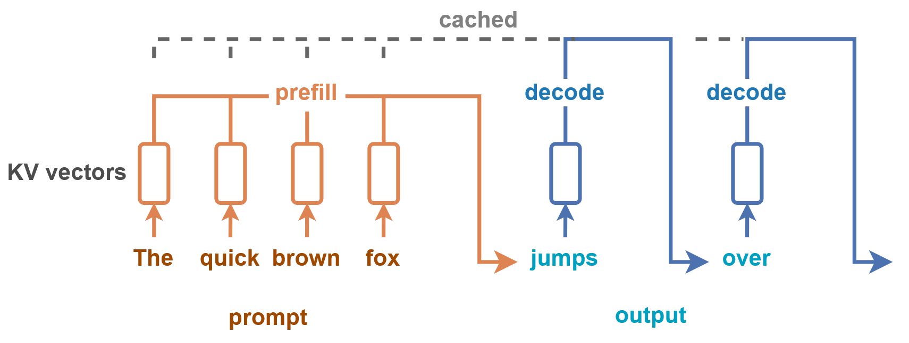
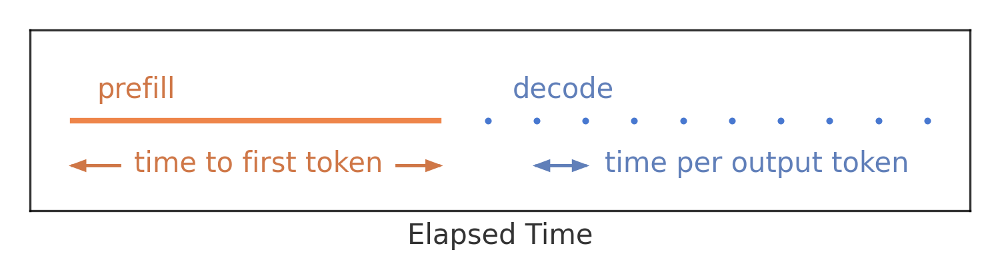
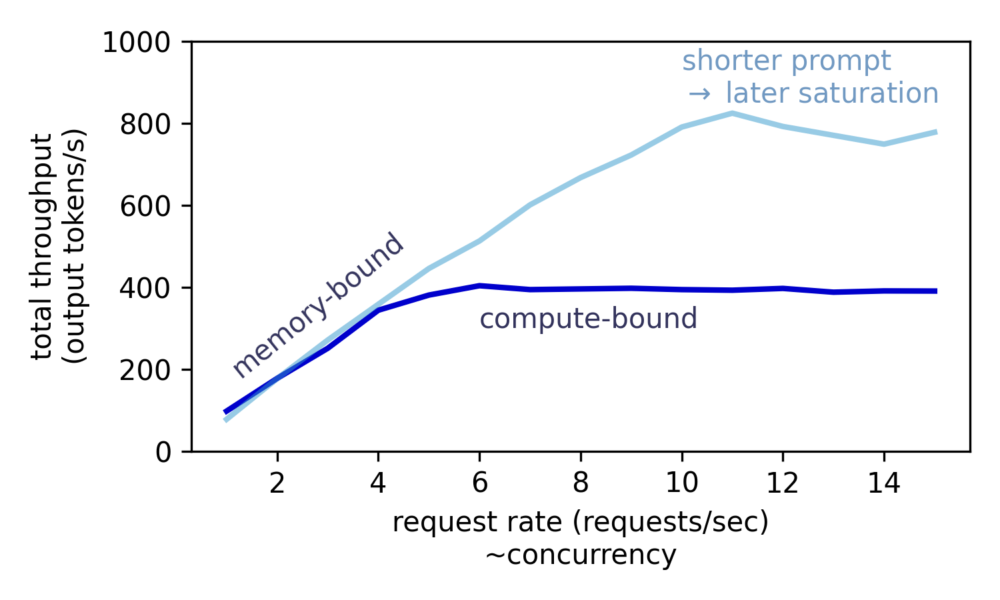
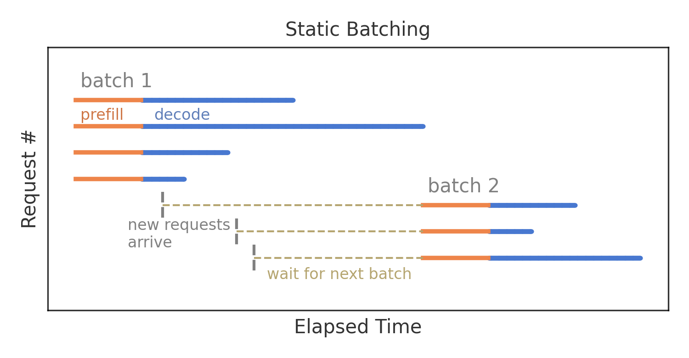
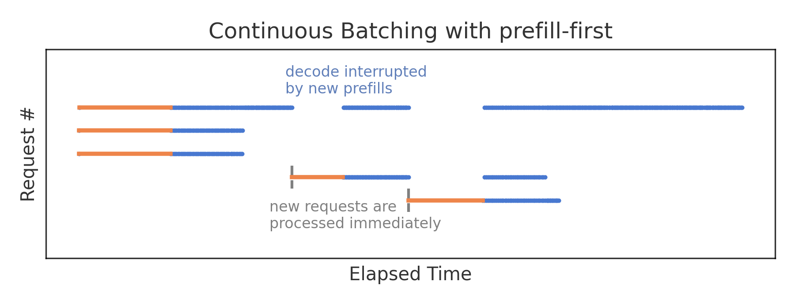
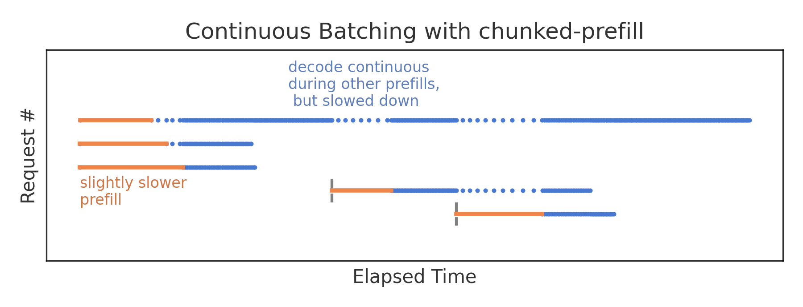

# Prefill and Decode for Concurrent Requests - Optimizing LLM Performance
预填充和解码并发请求 - 优化 LLM 性能

* https://huggingface.co/blog/tngtech/llm-performance-prefill-decode-concurrent-requests

Handling load from multiple users in parallel is crucial for the performance of LLM applications. In the [previous part](https://huggingface.co/blog/tngtech/llm-performance-request-queueing) of our series on LLM performance, we discussed queueing strategies for the prioritization of different users. In this second part, we will now focus on the concurrent processing of requests, and how it impacts relevant metrics such as latency and throughput as well as GPU resource utilization.
对于 LLM 应用程序而言, 并行处理来自多个用户的负载至关重要. 在 LLM 性能系列文章的前一部分中, 我们讨论了用于确定不同用户优先级的排队策略. 在第二部分中, 我们将重点关注请求的并发处理, 以及它如何影响延迟、吞吐量和 GPU 资源利用率等相关指标.

At TNG, we are self-hosting numerous Large Language Models on our cluster of 24 H100 GPUs. It supports 50 different applications, handles over 5,000 inferences per hour, and generates more than ten million tokens every day.
在 TNG, 我们利用由 24 个 H100 GPU 组成的集群, 自主托管了众多大型语言模型. 该集群支持 50 个不同的应用程序, 每小时可处理超过 5000 次推理, 每天生成超过一千万个 tokens.

### The Two Stages of Token Generation: Prefill and Decode
Token 生成的两个阶段: 预填充和解码

Most LLMs generate text token by token, which guarantees that every new token is computed based on all preceding tokens (this model property is called *auto-regressive*). The first output token depends on all prompt tokens, but the second output token already depends on all prompt tokens *plus* the first output token, and so on. As a consequence, token generation cannot be parallelized at the level of an individual request.
大多数 LLM 逐个生成文本 token, 这保证了每个新 token 都是基于所有先前的 tokens 计算得出的(这种模型特性称为自回归). 第一个输出 tokens 依赖于所有 prompt tokens, 而第二个输出 tokens 又依赖于所有 prompt tokens 加上第一个输出 tokens, 依此类推. 因此, tokens 生成无法在单个请求级别并行化.

In LLMs with attention mechanisms, computing a new token requires calculating *key*, *value*, and *query* vectors for each preceding token. Fortunately, the results of some particular calculations can be re-used for subsequent tokens. This concept is known as `key-value (KV) cache`. For every additional output token, only one more set of *key* and *value* vectors needs to be calculated and added to the KV cache. For the very first output token, however, we start with an initially empty KV cache and need to calculate as many sets of *key* and *value* vectors as there are tokens in the input prompt. Luckily, and in contrast to any later token generation, all input tokens are known from the beginning, and we can parallelize the calculation of their respective *key* and *value* vectors. This difference motivates the distinction between the `prefill (computing the first output token)` and the `decode phase (computing any later output token)`.
在带有注意力机制的层级模型(LLM)中, 计算一个新 tokens 需要计算每个前一个 tokens 的 key 向量、value 向量和 query 向量. 幸运的是, 某些特定计算的结果可以重复用于后续 tokens. 这种概念被称为`键值(KV)缓存`. 对于每个额外的输出 tokens, 只需要计算并向 KV 缓存添加一组新的 key 向量和 value 向量. 然而, 对于第一个输出 tokens, 我们从一个初始为空的 KV 缓存开始, 需要计算与输入 prompt 中的 tokens 数量相同的 key 向量和 value 向量. 幸运的是, 与任何后续的 tokens 生成不同, 所有输入 tokens 从一开始就是已知的, 我们可以并行计算它们各自的 key 向量和value 向量. 这种差异促使我们区分`预填充阶段(计算第一个输出 tokens)`和`解码阶段(计算任何后续的输出 tokens)`.

In the prefill phase, the calculations for all input tokens can be executed in parallel, while in the decode phase, no parallelization is possible on the level of individual requests.
在预填充阶段, 所有输入 tokens 的计算可以并行执行, 而在解码阶段, 单个请求的级别上不可能进行并行化.

*prefill:* parallel processing of prompt tokens, *decode:* sequential processing of single output tokens.
预填充: 并行处理 prompt tokens, 解码: 顺序处理单个输出 tokens.

#### Metrics
指标

The difference between the prefill and decode phases is also reflected in two key metrics for text generation: `Time to first token` and `time per output token`. The **time to first token** is given by the latency of the prefill phase, while the **time per output token** is the latency of a single decode step. Even though the prefill phase also generates only a single token, it takes much longer than a single decode step, because all input tokens need to be processed. On the other hand, the prefill phase is much faster with respect to the number of input tokens than a decode phase for the same number of output tokens (this difference is the reason why commercial LLM APIs charge input tokens at a much lower rate than ouput tokens).
预填充阶段和解码阶段之间的差异也体现在文本生成的两个关键指标上: Time to first token(首词响应时间)和 time per output token(每个输出词的执行时间). 首词响应时间指的是预填充阶段的延迟, 而每个输出词的执行时间指的是单个解码步骤的延迟. 尽管预填充阶段也只生成一个词, 但由于需要处理所有输入词, 因此其耗时远长于单个解码步骤. 另一方面, 对于相同数量的输入词, 预填充阶段的速度远快于相同数量的输出词的解码阶段(正是由于这种差异, 商业 LLM API 对输入词的收费远低于对输出词的收费).

Both latencies are relevant metrics for interactive applications like a chat bot. If users have to wait for more than 5 seconds before they see a response, they might think that the application is broken and leave. Similarly, if the text generation is as slow as 1 token per second, they would not be patient enough to wait until it is finished. Typical latency targets for interactive applications are 100-300ms per output token (i.e. a token generation speed of 3-10 tokens per second, at least as fast as reading speed, which ideally allows for skimming the output text as it is being generated), and a *time to first token* of 3 seconds or less. Both of these latency targets can be quite challenging to achieve, depending on the model size, hardware, prompt length, and concurrent load.
对于聊天机器人等交互式应用而言, 延迟和首尾响应时间都是重要的指标. 如果用户需要等待超过 5 秒才能看到回复, 他们可能会认为应用出现故障而离开. 同样, 如果文本生成速度慢到每秒 1 个 tokens, 用户也没有足够的耐心等待其完成. 交互式应用的典型延迟目标是每个输出 tokens 100-300 毫秒(即 tokens 生成速度为每秒 3-10 个 tokens, 至少与阅读速度一样快, 理想情况下, 这允许用户在文本生成的同时快速浏览), 以及首尾响应时间为 3 秒或更短. 根据模型大小、硬件配置、prompt 长度和并发负载等因素, 实现这两个延迟目标都可能相当具有挑战性.

Other, non-interactive use cases might not be interested in the latencies of individual requests, but only in the total **token throughput** (tokens per second, summed up over all concurrent requests). This could be relevant when you want to generate translations for books, or summarize code files in a large repository.
其他非交互式用例可能并不关心单个请求的延迟, 而只关注总 token 吞吐量 (每秒 token 数, 所有并发请求的总和). 例如, 当您需要为书籍生成翻译或汇总大型代码库中的代码文件时, 这一点就非常重要.

As we will see in a later section, there generally is a trade-off between maximizing the total throughput and minimizing latencies for each individual request.
正如我们将在后面的章节中看到的那样, 通常需要在最大化总吞吐量和最小化每个单独请求的延迟之间进行权衡.

#### Resource Utilization
资源利用

Because of the parallelized calculation for all input tokens, the prefill phase is very GPU compute-intensive. In contrast, the decode step for an individual output token utilizes very little computational power; here, the speed is typically limited by the GPU memory bandwidth, i.e. how quickly model weights and activations (including *key* and *value* vectors) can be loaded from and accessed within the GPU memory.
由于所有输入 tokens 的计算都是并行进行的, 因此预填充阶段对 GPU 的计算能力要求非常高. 相比之下, 单个输出 tokens 的解码步骤所需的计算能力非常低; 此时, 速度通常受限于 GPU 内存带宽, 即模型权重和激活值(包括 key 向量和 value 向量)从 GPU 内存加载和访问的速度.

In general, token throughput can be increased until the GPU utilization (w.r.t. computational power) is saturated. In the prefill phase, a single request with a long prompt can already achieve maximum GPU utilization. In the decode phase, the **GPU utilization can be increased by batch processing** of multiple requests. As a consequence, when you plot the token throughput as a function of the number of concurrent requests, you see an almost linear increase in throughput at low concurrency, because this memory-bound regime benefits from larger batch sizes. Once the GPU utilization saturates and the compute-bound regime is entered, the throughput remains invariant to an increase in concurrency.
一般来说, token 吞吐量可以不断提高, 直到 GPU 利用率(相对于计算能力而言)达到饱和. 在预填充阶段, 单个带有较长 prompt 的请求即可达到 GPU 利用率的最大值. 在解码阶段, 可以通过批量处理多个请求来提高 GPU 利用率. 因此, 当您绘制 token 吞吐量与并发请求数的关系图时, 会发现低并发量下吞吐量几乎呈线性增长, 因为这种内存密集型状态受益于更大的批处理大小. 一旦 GPU 利用率达到饱和, 进入计算密集型状态, 吞吐量将不再随并发量的增加而增加.

### Concurrent Processing
并发处理

We will now consider how exactly an inference engine handles multiple requests that arrive within a short time interval.
接下来, 我们将探讨推理引擎如何处理在短时间内到达的多个请求.

Both the prefill and decode phases can make use of batching strategies to apply the same set of operations to different requests. But what are the consequences of running prefill and decode of different requests at the same time?
预填充和解码阶段都可以利用批处理策略, 对不同的请求应用相同的操作集. 但是, 同时对不同的请求运行预填充和解码会有什么后果呢?

#### Static Batching vs. Continuous Batching
静态批次生产与连续批次生产

The most naive form of batching is called **static batching**. (1) You start with an empty batch, (2) you fill the batch with as many items as are waiting and as fit into the batch, (3) you process the batch until all batched items are finished, and (4) you repeat the procedure with a new empty batch.
最简单的批处理形式称为静态批处理. (1) 从空批次开始, (2) 将等待处理的物品数量以及批次大小填满该批次, (3) 处理该批次直到所有批处理物品都处理完毕, (4) 使用新的空批次重复该过程.

All requests start their prefill phase at the same time. Since prefill is just a single, but heavily parallelized, GPU operation (think of it as a very large matrix multiplication), the prefill phases of all concurrent requests are completed at the same time. Then, all decode phases start simultaneously. Requests with fewer output tokens would finish earlier, but because of the static batching the next waiting request can only start once the longest batched request has been completed.
所有请求同时开始预填充阶段. 由于预填充只是一个高度并行化的 GPU 操作(可以将其想象成一个非常大的矩阵乘法), 所有并发请求的预填充阶段都会同时完成. 然后, 所有解码阶段同时开始. 输出 token 较少的请求会更早完成, 但由于采用了静态批处理, 下一个等待的请求只能在批处理时间最长的请求完成后才能开始.

**Static batching optimizes the time per output token**, since the decode phase is uninterrupted. The drawback is a very inefficient resource utilization. Since a single, long prompt can already saturate the compute power during prefill, handling multiple prefills in parallel does not yield a speed-up and will certainly max out GPU utilization. In contrast, the GPU will likely be underutilized during the decode phase, since even a large number of concurrent decodes is not as compute-intensive as the prefill for a long prompt.
静态批处理优化了每个输出 tokens 的处理时间, 因为解码阶段不会中断. 但缺点是资源利用率极低. 由于单个较长的 prompt 在预填充阶段就已经会耗尽计算能力, 因此并行处理多个预填充操作并不会提高速度, 反而肯定会使 GPU 利用率达到极限. 相比之下, 在解码阶段, GPU 的利用率可能较低, 因为即使大量并发解码操作的计算密集程度也不及长 prompt 的预填充操作.

The biggest disadvantage, however, is the potentially long *time to first token*. Even if some short requests finish early, the next queuing request has to wait for the longest decode in the batch to finish before its prefill can begin. Because of this flaw of static batching, inference engines typically implement **continuous batching** strategies. Here, any completed request is immediately removed from the batch, and the batch space is filled with the next request in line. As a consequence, every continuous batching strategy has to deal with concurrency between prefill and decode phases.
然而, 最大的缺点是首次 tokens 生成时间可能过长. 即使一些短请求提前完成, 下一个排队的请求也必须等待批次中最长的解码请求完成才能开始预填充. 由于静态批处理的这一缺陷, 推理引擎通常会实现**连续批处理**策略. 在这种策略中, 任何已完成的请求都会立即从批次中移除, 并将批次空间填充到下一个排队的请求中. 因此, 每种连续批处理策略都必须处理预填充和解码阶段之间的并发问题.

#### Prefill-First
预填充-首先

In an attempt to reduce the waiting time of requests, inference engines such as vLLM and TGI schedule the prefill phase of new requests as soon as they arrive and fit into the current batch. It is possible to run the prefill of new requests in parallel with a single decode step for each of all previous requests, but since everything is executed in the same GPU operation, its duration is dominated by the prefill, and for every request in the decode phase only a single output token can be generated in that time. Therefore, this **prioritization of prefills minimizes the time to first token** but interrupts the decode phase of already running requests. In a chat application, users can experience this as pausing of the streamed token generation when other users submit long prompts.
为了减少请求的等待时间, 诸如 vLLM 和 TGI 之类的推理引擎会在新请求到达且符合当前批次要求时立即安排预填充阶段. 虽然可以将新请求的预填充与之前所有请求的单个解码步骤并行运行, 但由于所有操作都在同一个 GPU 操作中执行, 因此预填充过程占据了大部分时间, 并且在解码阶段, 每个请求只能生成一个输出 token. 因此, 这种预填充优先策略虽然可以最大限度地缩短生成第一个 token 的时间,  但会中断正在运行的请求的解码阶段. 在聊天应用中, 当其他用户提交较长的 prompt 时, 用户可能会感受到 token 生成过程的暂停.

In the following measurement you can see the effect of continuous batching with a prefill-first strategy.
在以下测量中, 您可以看到采用预填充优先策略的连续批处理的效果.

The time to first token is minimized because new requests are processed immediately. But during each prefill, only a single decode step can be executed for every concurrent request, despite its otherwise much shorter execution time. Therefore, prefills effectively interrupt other decodes with this strategy.
由于新请求会立即处理, 因此获得第一个 token 所需的时间最短. 但在每次预填充期间, 尽管解码步骤的执行时间通常要短得多, 但每个并发请求只能执行一个解码步骤. 因此, 采用这种策略, 预填充实际上会中断其他解码操作.

#### Chunked Prefill
块状预填充物

One approach to alleviate the impact of interruptive prefills on running decodes is a `chunked prefill`. Instead of processing the entire prompt in a single prefill step, it can be distributed over multiple chunks. Then there can be as many concurrent decode steps during prefill as there are prefill chunks (as opposed to only a single decode step per concurrent request during the entire prefill). A chunked prefill step will still take longer than an isolated decode step, but for small chunk sizes the user now experiences only a slowing-down of token generation instead of a complete pause; this reduces the average *time per output token*. From the perspective of the interrupting request, a chunked prefill comes with some overhead and takes a bit longer than an isolated, contiguous prefill, so there is a small increase in the *time to first token*. With the chunk size we now have a **tuning knob for prioritizing either the time to first token or the time per output token**. Typical chunk sizes are between 512 and 8192 tokens (the vLLM default was 512 when chunked prefill was first implemented, and was later updated to higher values).
为了减轻中断式预填充对正在进行的解码操作的影响, 一种方法是`分块预填充`. 预填充不是在单个步骤中处理整个 prompt, 而是将其分散到多个块中. 这样, 在预填充期间, 可以同时进行与预填充块数量相同的并发解码步骤(而不是像之前那样, 在整个预填充过程中每个并发请求只能进行一个解码步骤). 分块预填充步骤仍然比单独的解码步骤耗时更长, 但对于较小的块大小, 用户现在只会感受到 token 生成速度的减慢, 而不是完全暂停; 这降低了每个输出 token 的平均时间. 从中断请求的角度来看, 分块预填充会带来一些开销, 并且比单独的、连续的预填充耗时稍长, 因此第一个 token 的生成时间会略有增加. 现在, 我们可以通过调整块大小来优先考虑第一个 token 的生成时间或每个输出 token 的生成时间. 典型的块大小介于 512 到 8192 个 tokens 之间(分块预填充首次实现时, vLLM 的默认值为 512, 后来更新为更高的值).

When the prefill is chunked into several steps, concurrent decodes of other requests can produce one output token for every prefill chunk instead of just one output token for the entire prefill phase. While we can't resolve individual prefill chunks in our client-side measurements, their impact is visible in concurrent decodes, which appear chunked into individual dots instead of almost continuous lines.
当预填充操作被分成多个步骤时, 其他请求的并发解码可能会为每个预填充块生成一个输出 token, 而不是像通常那样为整个预填充阶段生成一个输出 token. 虽然我们的客户端测量无法解析单个预填充块, 但它们的影响在并发解码中显而易见, 解码结果会呈现为一个个点, 而不是几乎连续的线条.

The biggest advantage of this strategy is, however, that **chunked prefill maximizes resource efficiency**. Prefill is compute-intensive, while decode is memory-bound. By running both operations in parallel, one can increase the overall throughput without being limited by GPU resources. Of course, maximum efficiency is only achieved at a certain chunk size, which in turn depends on the exact load pattern.
然而, 这种策略最大的优势在于分块预填充能够最大限度地提高资源效率. 预填充是计算密集型操作, 而解码是内存密集型操作. 通过并行运行这两个操作, 可以在不受限于 GPU 资源的情况下提高整体吞吐量. 当然, 只有在特定的块大小下才能达到最高效率, 而块大小又取决于具体的负载模式.

In a standard vLLM deployment and for evenly sized requests, we observed that **chunked prefill increased the total token throughput by +50%**. It is now enabled for every vLLM deployment of self-hosted LLMs at TNG. Overall, chunked prefill is a good default strategy for most use cases. Optimizing the chunk size, however, is quite difficult in environments with unpredictable load patterns (like TNG with its many diverse applications); typically, you stick with the defaults.
在标准的 vLLM 部署中, 对于大小均匀的请求, 我们观察到分块预填充使总 token 吞吐量提高了 50%. 目前, TNG 的所有自托管 LLM 的 vLLM 部署都已启用此功能. 总体而言, 分块预填充对于大多数用例来说都是一个不错的默认策略. 然而, 在负载模式不可预测的环境中(例如 TNG 及其众多不同的应用程序), 优化分块大小相当困难; 通常情况下, 我们会坚持使用默认设置.

Regardless of the exact chunk size configuration, concurrent processing with chunked prefill comes with two challenges that we will address in [the next article](https://huggingface.co/blog/tngtech/llm-performance-blocked-by-long-prompts).
无论具体的块大小配置如何, 使用分块预填充进行并发处理都会面临两个挑战, 我们将在下一篇文章中讨论这些挑战.
