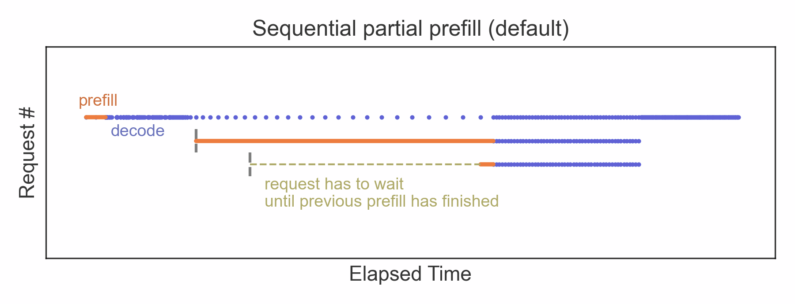
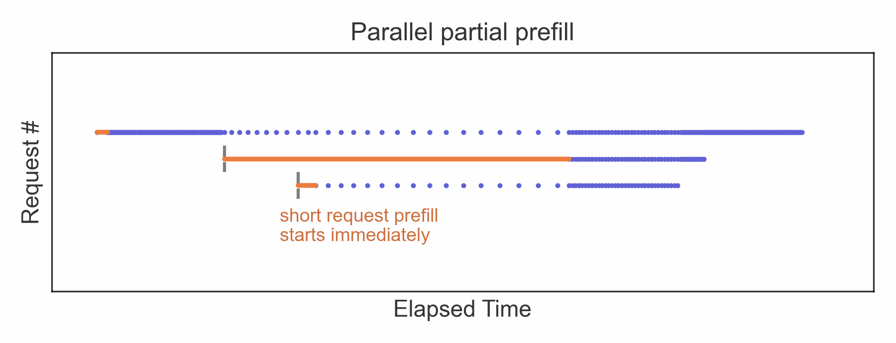
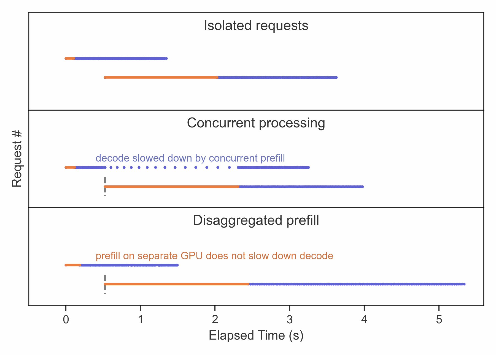

# How Long Prompts Block Other Requests - Optimizing LLM Performance

* https://huggingface.co/blog/tngtech/llm-performance-blocked-by-long-prompts

In [the previous part](https://huggingface.co/blog/tngtech/llm-performance-prefill-decode-concurrent-requests) of our series on LLM performance, we looked into the differences between the prefill and decode phases during token generation. In short: for the first output token **(prefill step)**, the entire prompt needs to be processed, which can be parallelized efficiently and can saturate GPU utilization. For all later output tokens **(decode steps)**, only a single additional token needs to be processed, which is less compute-intensive but must be done sequentially. When many requests are processed concurrently, any strategy that aims for low latency needs to run prefill steps for newly arriving requests while the decode steps of previously scheduled requests are still ongoing. Concurrent processing of new as well as running requests therefore requires careful balancing between the prefill and decode stages, which presents two major challenges, which we will discuss in the following. One is a readily solvable issue, while the other one constitutes a more fundamental flaw.
在上一篇关于 LLM 性能的文章中, 我们探讨了 token 生成过程中预填充和解码阶段之间的差异. 简而言之: 对于第一个输出 token (预填充步骤), 需要处理整个 prompt, 这可以高效地并行化, 并可能使 GPU 利用率达到饱和. 对于所有后续的输出 token (解码步骤), 只需要处理一个额外的 token, 计算量较小, 但必须顺序执行. 当大量请求并发处理时, 任何旨在降低延迟的策略都需要在先前已调度请求的解码步骤仍在进行时, 对新到达的请求执行预填充步骤. 因此, 并发处理新请求和正在运行的请求需要在预填充和解码阶段之间进行仔细的平衡, 这带来了两个主要挑战, 我们将在下文中讨论. 其中一个问题很容易解决, 而另一个问题则构成了一个更根本的缺陷.

### The Simpler Challenge: Long Prompts Block the Queue
更简单的挑战: 过长的 prompt 会阻塞队列

Since individual decode steps are not compute-intensive, one can increase throughput by batching decodes of multiple requests. For prefill, however, this approach does not work. Because of the parallelized processing of all prompt tokens, a single prefill step can already saturate GPU utilization. Consequently, in the default chunked-prefill strategy of vLLM, each prefill chunk contains only prompt tokens of a single request. The next request in line has to wait until the previous prefill phase has been finished before its own prefill phase can start.
由于单个解码步骤的计算量并不大, 因此可以通过批量解码多个请求来提高吞吐量. 然而, 对于预填充来说, 这种方法并不适用. 由于所有 prompt 的并行处理, 单个预填充步骤就可能使 GPU 利用率达到饱和. 因此, 在 vLLM 的默认分块预填充策略中, 每个预填充块仅包含单个请求的 prompt. 下一个请求必须等待前一个预填充阶段完成后才能开始其自身的预填充阶段.

This sequential scheduling of prefill chunks for different requests poses a challenge: whenever a request with a very long prompt is scheduled for prefill, any subsequent request has to wait for the duration of the long prefill before its processing starts; **a long prompt blocks the prefill-queue**. (Note that the sequential processing of prefills is the default characteristic of *chunked-prefill* and only appears when there already is a concurrent request in its decode phase; hence the name "partial prefill".)
这种针对不同请求按顺序调度预填充块的方式带来了一个挑战: 每当一个带有很长 prompt 的请求被安排进行预填充时, 任何后续请求都必须等待很长的预填充持续时间才能开始处理; 过长的 prompt 会阻塞预填充队列. (请注意, 预填充的顺序处理是分块预填充的默认特性, 并且仅在已有一个并发请求处于解码阶段时才会出现; 因此得名"部分预填充".)

By default, prefills for new requests are scheduled sequentially if they run concurrently with other decodes. A single request with a long prompt can cause long waiting times for subsequent requests before their first output tokens are generated, as demonstrated by this measurement. Notice that the last prefill chunk of the second request leaves room to handle the prefill of the third request in parallel.
默认情况下, 如果新请求的预填充与其他解码操作并发运行, 则会按顺序调度. 正如本次测量所示, 单个带有较长 prompt 的请求可能会导致后续请求在生成第一个输出 token 之前等待时间过长. 请注意, 第二个请求的最后一个预填充块留出了空间, 可以并行处理第三个请求的预填充.

Unfortunately, this challenge can neither be solved with vLLM-side priority scheduling (see [the first article of this series](https://huggingface.co/blog/tngtech/llm-performance-request-queueing)) nor with a more sophisticated upstream scheduler. The reason is that the long prompt can be scheduled before any subsequent requests exist, so there is nothing the scheduler could wait for.
遗憾的是, 无论是使用 vLLM 端的优先级调度(参见本系列的第一篇文章), 还是使用更复杂的上游调度器, 都无法解决这个问题. 原因在于, 长 prompt 可以在任何后续请求出现之前进行调度, 因此调度器没有任何可以等待的内容.

#### Request-Parallel Prefills
请求并行预填充

A straightforward solution would be to process prefill chunks of different requests in parallel. This might not be resource-optimized, as single-request prefill chunks could already saturate compute-power. Any additional prefill executed in parallel would likely prolong the prefill duration a bit and slow down any concurrent decode-requests even further. This would be acceptable if it reduced the latency of short requests and made the system appear more responsive. This approach fails, however, when the next request in line has a long prompt too. In such a case, two compute-intensive prefills would be batched together and result in a severe slowdown.
一个简单的解决方案是并行处理不同请求的预填充数据块. 但这可能并非资源优化方案, 因为单个请求的预填充数据块可能已经耗尽了计算能力. 任何并行执行的额外预填充操作都可能略微延长预填充持续时间, 并进一步减慢任何并发的解码请求. 如果这能降低短请求的延迟, 使系统看起来响应更快, 那么这种做法是可以接受的. 然而, 如果下一个请求的 prompt 也很长, 这种方法就行不通了. 在这种情况下, 两个计算密集型的预填充操作会被合并在一起, 导致严重的性能下降.

In one of the latest vLLM updates, an improved strategy has been implemented: it allows for parallel prefills of different requests but with a limit to the number of concurrently processed long prompt requests. An example configuration could enable batching of prefills for four requests, but only one of them may be longer than 10,000 prompt tokens. With such a configuration, the behavior for longer requests is still the same as before: **long prompts are processed sequentially**. Short requests, however, no longer need to wait for the long prefill of a previous request to finish; **short prompts can take a fast lane**. These requests no longer suffer from long waiting times and show much lower *time-to-first-token* metrics.
在最新的 vLLM 更新中, 我们实施了一项改进策略: 它允许并行预填充不同的请求, 但限制了同时处理的长 prompt 请求的数量. 例如, 我们可以配置为批量预填充四个请求, 但其中只有一个请求的长度可以超过 10,000 个 prompt. 在这种配置下, 较长请求的行为与之前相同: 长 prompt 按顺序处理. 然而, 短请求不再需要等待前一个请求的长 prompt 预填充完成; 短 prompt 可以走快速通道. 这些请求不再需要长时间等待, 并且首 token 获取时间指标显著降低.

Of course, parallel prefills can only reduce waiting times; but the **time-per-output-token remains elevated** during the concurrent long-prefill operation. In this regard, request-parallel prefills show the same behavior and performance as standard chunked-prefill, just with a shorter time-to-first-token.
当然, 并行预填充只能减少等待时间; 但在并发长时间预填充操作期间, 每个输出 token 的耗时仍然较高. 在这方面, 请求并行预填充与标准分块预填充表现出相同的行为和性能, 只是第一个 token 的生成时间更短.

With parallel partial prefills enabled, new requests can start their prefill without having to wait for the previous requests to finish their prefill phases, resulting in a short time to first token. The total completion time sees only small improvements, as decode steps are still slowed down by the concurrent prefill. Our measurement shows a clear reduction of *time-to-first-token* for the third request, compared with the sequential partial prefill scenario.
启用并行部分预填充后, 新请求无需等待先前请求完成预填充阶段即可开始预填充, 从而缩短了首次获取 token 的时间. 总完成时间仅有小幅提升, 因为并发预填充仍然会减慢解码步骤的速度. 我们的测量结果显示, 与顺序部分预填充方案相比, 第三个请求的首次获取 token 时间明显缩短.

### The Fundamental Flaw: Token Generation Slowed Down by Parallel Prefills
根本缺陷: 并行预填充导致 Token 生成速度减慢

Whenever prefill and decode of different requests are executed in the same GPU operation, it takes longer than for an isolated decode step. The user experiences an interruption or a slowing down of the token generation by a subsequent request. In particular, **a single request with a long prompt is sufficient to slow down all previously scheduled requests** that are already in their decode phases.
当预填充和解码不同请求的操作在同一 GPU 操作中执行时, 耗时会比单独执行解码步骤更长. 用户会感受到后续请求导致的 token 生成中断或速度减慢. 特别是, 一个带有较长 prompt 的请求就足以减慢所有先前已处于解码阶段的请求的速度.

This is a fundamental flaw in the concurrent processing of prefill and decode on the same GPUs, because there is little you can do:
这是在同一 GPU 上同时处理预填充和解码操作的一个根本缺陷, 因为你几乎无能为力:

- (a) You could **penalize long prompts and let them wait** (e.g. until all short, high-priority requests have been finished). This comes at the price of increased latency for those requests, and it does not fix the root cause: in particular, when request-parallel prefills are enabled, the slowing down also affects short-prompt requests that are scheduled after the long-prompt one. Additionally, in times of high load, there can be a very small chance for long-prompt requests to be scheduled within reasonable time. At TNG, we implemented a similar strategy in an API for batch requests which are scheduled with very low priority.
  (a) 您可以对长时间的 prompt 信息进行惩罚, 并让它们等待 (例如, 直到所有短的、高优先级的请求都完成). 但这会增加这些请求的延迟, 而且并不能解决根本问题: 尤其是在启用请求并行预填充时, 这种减速也会影响到在长时间 prompt 信息请求之后调度的短 prompt 信息请求. 此外, 在高负载情况下, 长时间 prompt 信息请求在合理时间内被调度的概率非常低. 在 TNG, 我们针对优先级极低的批量请求, 在一个 API 中实施了类似的策略.

- (b) You could have **a separate inference-server for long-prompt requests** and a router that forwards requests depending on load and prompt lengths. This approach requires more GPU resources but the inference server for short-context requests has lower requirements on GPU memory (for example, Llama-3.3-70B needs four H100 for a context length of 130k tokens but a second deployment with two H100 could already serve requests with context length of <10k tokens). However, a sophisticated router design is required in order to optimize resource utilization. For example, when there are no long-prompt requests the larger inference server should still be utilized.
  (b) 您可以为长 prompt 请求设置一个独立的推理服务器, 并使用路由器根据负载和 prompt 长度转发请求. 这种方法需要更多的 GPU 资源, 但处理短上下文请求的推理服务器对 GPU 内存的需求较低(例如, Llama-3.3-70B 需要四个 H100 来处理 13 万个 token 的上下文长度, 而第二个仅使用两个 H100 的部署即可处理 1 万个 token 的上下文长度请求). 然而, 为了优化资源利用率, 需要设计一个复杂的路由器. 例如, 即使没有长 prompt 请求, 也应该使用资源更充足的推理服务器.

- (c) You could have separate **inference engines for prefill and decode**. This architecture of *disaggregated prefill* combines multiple vLLM deployments, each of which runs only prefill or only decode. After finishing the prefill phase, the KV cache is transferred to the decode worker which causes a small communication overhead. But since prefill and decode run isolated on different GPUs, there is no direct disruption of decodes caused by concurrent prefills anymore.
  (c) 您可以为预填充和解码分别使用独立的推理引擎. 这种解耦式预填充架构结合了多个 vLLM 部署, 每个部署可以单独运行预填充或解码. 预填充阶段完成后, 键值缓存会转移到解码工作进程, 这会带来少量的通信开销. 但由于预填充和解码在不同的 GPU 上独立运行, 因此并发预填充不会再直接干扰解码.

The difference between ideal concurrent processing (which would be no different from isolated requests), actual concurrent processing, and a disaggregated prefill strategy is shown by the following measurements:
以下测量结果显示了理想并发处理(与孤立请求无异)、实际并发处理和分解式预填充策略之间的差异:

When a short request is followed by a long-prompt request, its token generation is slowed down by the concurrent prefill. This can be prevented by separating vLLM deployments for prefill and decode workers on different GPUs ("disaggregated prefill"). All measurements show the same two requests, with a prompt length of 30k tokens for the interrupting request and 120 output tokens for each request. The disaggregated prefill implementation has been measured with vLLM v0.7.3 - here, the decode phase appears slower, likely lacking feature maturity.
当一个短请求后紧接着一个长 prompt 请求时, 并发的预填充操作会减慢 token 生成速度. 可以通过将预填充和解码工作进程部署在不同的 GPU 上("分离式预填充")来避免这种情况. 所有测量结果都显示相同的两个请求, 其中中断请求的 prompt 长度为 3 万个 token, 每个请求的输出 token 数为 120 个. 分离式预填充的实现已使用 vLLM v0.7.3 进行测量 - 在此版本中, 解码阶段的速度似乎较慢, 可能是由于功能不够成熟.

#### Disaggregated Prefill - Optimized for Latency
分散式预填充 - 针对延迟进行了优化

Separating prefill and decode eliminates the slowing-down of token generation in presence of other requests to a large extent, which makes it a very attractive strategy. It comes at the price of a second full-size vLLM deployment (e.g. for Llama-3.3-70B, you would need four H100 GPUs for a prefill worker and another four H100 GPUs for a decode worker if you wanted to support a maximum context length of 130k tokens). Another disadvantage is the uneven GPU utilization: because prefill is compute-intensive but decode is not, the prefill worker will likely saturate GPU utilization before the decode worker does. On the other hand, large clusters could consist of different numbers of prefill and decode workers (depending on load patterns), in order to optimize resource utilization.
将预填充和解码分离, 可以很大程度上消除在其他请求存在时 token 生成速度下降的问题, 因此是一种极具吸引力的策略. 但代价是需要部署第二个完整的 vLLM 集群(例如, 对于 Llama-3.3-70B 版本, 如果要支持最大 13 万个 token 的上下文长度, 则需要四个 H100 GPU 用于预填充工作进程, 另外四个 H100 GPU 用于解码工作进程). 另一个缺点是 GPU 利用率不均衡: 由于预填充是计算密集型任务, 而解码并非如此, 因此预填充工作进程很可能比解码工作进程更早达到 GPU 利用率饱和. 另一方面, 大型集群可以包含不同数量的预填充和解码工作进程(取决于负载模式), 以优化资源利用率.

Disaggregated prefill is not intended to increase total throughput, rather total "goodput" (i.e. the rate of requests that satisfy latency targets). Consequently, it is not the best use of GPU resources if your application is not sensitive to latency of individual requests.
分散式预填充并非旨在提高总吞吐量, 而是提高总"有效吞吐量"(即满足延迟目标的请求速率). 因此, 如果您的应用程序对单个请求的延迟不敏感, 则分散式预填充并非 GPU 资源的最佳利用方式.

Another caveat: the disaggregated prefill feature in vLLM is still experimental, and some optimizations and features are not accessible yet. For example, there are currently lower limits on context length, and the decode worker doesn't use CUDA graphs consistently, causing the slower decode of the long-prompt request in the figure above. Fortunately, these are not fundamental obstacles and are likely going to be solved in future versions of vLLM.
另一点需要注意的是: vLLM 中的解耦预填充功能仍处于实验阶段, 一些优化和功能尚未开放. 例如, 目前上下文长度存在下限, 并且解码工作进程对 CUDA 图的使用并不一致, 导致上图中长 prompt 请求的解码速度较慢. 幸运的是, 这些并非根本性问题, 很可能会在 vLLM 的未来版本中得到解决.
