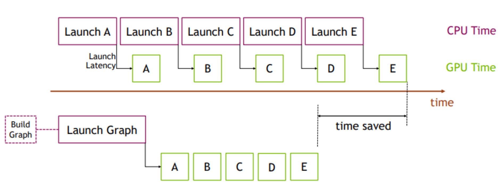
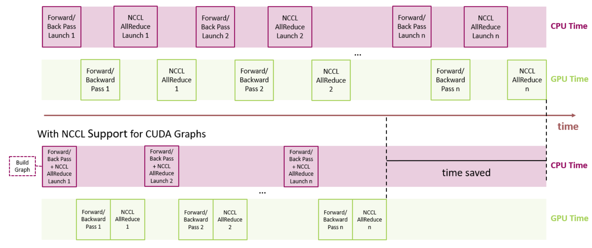

# Accelerating PyTorch with CUDA Graphs
利用 CUDA 图加速 PyTorch

* https://pytorch.org/blog/accelerating-pytorch-with-cuda-graphs/

Today, we are pleased to announce a new advanced CUDA feature, CUDA Graphs, has been brought to PyTorch. Modern DL frameworks have complicated software stacks that incur significant overheads associated with the submission of each operation to the GPU. When DL workloads are strong-scaled to many GPUs for performance, the time taken by each GPU operation diminishes to just a few microseconds and, in these cases, the high work submission latencies of frameworks often lead to low utilization of the GPU. As GPUs get faster and workloads are scaled to more devices, the likelihood of workloads suffering from these launch-induced stalls increases. To overcome these performance overheads, NVIDIA engineers worked with PyTorch developers to enable CUDA graph execution natively in PyTorch. This design was instrumental in scaling NVIDIA's MLPerf workloads (implemented in PyTorch) to over 4000 GPUs in order to achieve [record-breaking performance](https://blogs.nvidia.com/blog/2021/06/30/mlperf-ai-training-partners/).
今天, 我们很高兴地宣布, 一项全新的高级 CUDA 特性 - CUDA 图 - 已引入 PyTorch. 现代深度学习框架拥有复杂的软件栈, 每次向 GPU 提交操作都会产生显著的开销. 当深度学习工作负载为了提升性能而强扩展到多个 GPU 时, 每次 GPU 操作的耗时会缩短至几微秒, 在这种情况下, 框架较高的工作提交延迟往往会导致 GPU 利用率低下. 随着 GPU 速度的提升和工作负载扩展到更多设备, 工作负载遭受此类启动延迟的可能性也随之增加. 为了克服这些性能开销, NVIDIA 工程师与 PyTorch 开发人员合作, 在 PyTorch 中原生支持 CUDA 图执行. 这一设计对于将 NVIDIA 的 MLPerf 工作负载(使用 PyTorch 实现)扩展到 4000 多个 GPU 并取得突破性的性能至关重要.


CUDA graphs support in PyTorch is just one more example of a long collaboration between NVIDIA and Facebook engineers. [torch.cuda.amp](https://pytorch.org/docs/stable/amp.html), for example, trains with half precision while maintaining the network accuracy achieved with single precision and automatically utilizing tensor cores wherever possible. AMP delivers up to 3X higher performance than FP32 with just a few lines of code change. Similarly, NVIDIA's [Megatron-LM](https://github.com/NVIDIA/Megatron-LM) was trained using PyTorch on up to 3072 GPUs. In PyTorch, one of the most performant methods to scale-out GPU training is with [torch.nn.parallel.DistributedDataParallel](https://pytorch.org/docs/stable/generated/torch.nn.parallel.DistributedDataParallel.html#torch.nn.parallel.DistributedDataParallel) coupled with the NVIDIA Collective Communications Library ([NCCL](https://developer.nvidia.com/nccl)) backend.
PyTorch 对 CUDA 图的支持只是 NVIDIA 和 Facebook 工程师长期合作的又一例证. 例如, torch.cuda.amp 可以在保持单精度网络精度的同时, 使用半精度进行训练, 并尽可能自动利用张量核心. 只需几行代码的修改, AMP 的性能就能比 FP32 高出 3 倍. 同样, NVIDIA 的 Megatron-LM 模型也使用 PyTorch 在多达 3072 个 GPU 上进行了训练. 在 PyTorch 中, 扩展 GPU 训练性能最有效的方法之一是使用 torch.nn.parallel.DistributedDataParallel 并结合 NVIDIA Collective Communications Library (NCCL) 后端.

# CUDA Graphs

[CUDA Graphs](https://developer.nvidia.com/blog/cuda-10-features-revealed/), which made its debut in CUDA 10, let a series of CUDA kernels to be defined and encapsulated as a single unit, i.e., a graph of operations, rather than a sequence of individually-launched operations. It provides a mechanism to launch multiple GPU operations through a single CPU operation, and hence reduces the launching overheads.
CUDA Graphs(首次在 CUDA 10 中引入)允许将一系列 CUDA 内核定义并封装成一个单一单元, 即一个操作图, 而不是一系列单独启动的操作. 它提供了一种机制, 可以通过单个 CPU 操作启动多个 GPU 操作, 从而降低启动开销.

The benefits of CUDA graphs can be demonstrated with the simple example in Figure 1. On the top, a sequence of short kernels is launched one-by-one by the CPU. The CPU launching overhead creates a significant gap in between the kernels. If we replace this sequence of kernels with a CUDA graph, initially we will need to spend a little extra time on building the graph and launching the whole graph in one go on the first occasion, but subsequent executions will be very fast, as there will be very little gap between the kernels. The difference is more pronounced when the same sequence of operations is repeated many times, for example, overy many training steps. In that case, the initial costs of building and launching the graph will be amortized over the entire number of training iterations. For a more comprehensive introduction on the topic, see our blog [Getting Started with CUDA Graphs](https://developer.nvidia.com/blog/cuda-graphs) and GTC talk [Effortless CUDA Graphs](https://www.nvidia.com/en-us/on-demand/session/gtcspring21-s32082/).
图 1 中的简单示例可以很好地展示 CUDA 图的优势. 图中, CPU 逐个启动一系列短内核. CPU 的启动开销会在内核之间造成明显的延迟. 如果我们用 CUDA 图替换这一系列内核, 虽然最初需要花费一些额外的时间来构建图并一次性启动整个图, 但后续执行速度会非常快, 因为内核之间的延迟会非常小. 当相同的操作序列重复多次时, 例如经过多次训练步骤, 这种差异会更加显著. 在这种情况下, 构建和启动图的初始成本将被分摊到整个训练迭代次数中. 有关此主题的更全面介绍, 请参阅我们的博客文章 CUDA 图入门 和 GTC 演讲 轻松实现 CUDA 图.



## NCCL support for CUDA graphs

The previously mentioned benefits of reducing launch overheads also extend to NCCL kernel launches. NCCL enables GPU-based collective and P2P communications. With [NCCL support for CUDA graphs](https://docs.nvidia.com/deeplearning/nccl/user-guide/docs/usage/cudagraph.html), we can eliminate the NCCL kernel launch overhead.
前面提到的降低启动开销的好处同样适用于 NCCL 内核启动. NCCL 支持基于 GPU 的集体通信和 P2P 通信. 由于 NCCL 对 CUDA 图的支持, 我们可以消除 NCCL 内核启动开销.

Additionally, kernel launch timing can be unpredictable due to various CPU load and operating system factors. Such time skews can be harmful to the performance of NCCL collective operations. With CUDA graphs, kernels are clustered together so that performance is consistent across ranks in a distributed workload. This is especially useful in large clusters where even a single slow node can bring down overall cluster level performance.
此外, 由于 CPU 负载和操作系统等各种因素的影响, 内核启动时间可能难以预测. 这种时间偏差会对 NCCL 集体操作的性能造成不利影响. 借助 CUDA 图, 内核被集群化, 从而确保分布式工作负载中各个进程的性能一致. 这在大型集群中尤为重要, 因为即使单个节点速度较慢, 也会降低整个集群的性能.

For distributed multi-GPU workloads, NCCL is used for collective communications. If we look at training a neural network that leverages data parallelism, without NCCL support for CUDA graphs, we'll need a separate launch for each of forward/back propagation and NCCL AllReduce. By contrast, with NCCL support for CUDA graphs, we can reduce launch overhead by lumping together the forward/backward propagation and NCCL AllReduce all in a single graph launch.
对于分布式多 GPU 工作负载, NCCL 用于集体通信. 如果我们考虑训练一个利用数据并行性的神经网络, 在 NCCL 不支持 CUDA 图的情况下, 我们需要分别启动前向/反向传播和 NCCL AllReduce. 相比之下, 如果 NCCL 支持 CUDA 图, 我们可以将前向/反向传播和 NCCL AllReduce 合并到单个图启动中, 从而降低启动开销.



# PyTorch CUDA Graphs

From PyTorch v1.10, the CUDA graphs functionality is made available as a set of beta APIs.
从 PyTorch v1.10 开始, CUDA 图形功能以一组 beta API 的形式提供.

### API overview
API 概述

PyTorch supports the construction of CUDA graphs using [stream capture](https://docs.nvidia.com/cuda/cuda-c-programming-guide/index.html#creating-a-graph-using-stream-capture), which puts a CUDA stream in capture mode. CUDA work issued to a capturing stream doesn't actually run on the GPU. Instead, the work is recorded in a graph. After capture, the graph can be launched to run the GPU work as many times as needed. Each replay runs the same kernels with the same arguments. For pointer arguments this means the same memory addresses are used. By filling input memory with new data (e.g., from a new batch) before each replay, you can rerun the same work on new data.
PyTorch 支持使用流捕获来构建 CUDA 图, 它将 CUDA 流置于捕获模式. 发送到捕获流的 CUDA 任务实际上并不在 GPU 上运行, 而是被记录在一个图中. 捕获完成后, 可以启动该图, 根据需要多次运行 GPU 任务. 每次重放都使用相同的内核和相同的参数. 对于指针参数, 这意味着使用相同的内存地址. 通过在每次重放之前用新数据(例如, 来自新批次的数据)填充输入内存, 您可以对新数据重新运行相同的任务.

Replaying a graph sacrifices the dynamic flexibility of typical eager execution in exchange for greatly reduced CPU overhead. A graph's arguments and kernels are fixed, so a graph replay skips all layers of argument setup and kernel dispatch, including Python, C++, and CUDA driver overheads. Under the hood, a replay submits the entire graph's work to the GPU with a single call to [cudaGraphLaunch](https://docs.nvidia.com/cuda/cuda-runtime-api/group__CUDART__GRAPH.html#group__CUDART__GRAPH_1g1accfe1da0c605a577c22d9751a09597). Kernels in a replay also execute slightly faster on the GPU, but eliding CPU overhead is the main benefit.
重放图牺牲了典型即时执行的动态灵活性, 换取了大幅降低的 CPU 开销. 图的参数和内核是固定的, 因此图重放跳过了所有参数设置和内核分发层, 包括 Python、C++ 和 CUDA 驱动程序的开销. 在底层, 重放通过一次调用 `cudaGraphLaunch` 将整个图的工作提交给 GPU. 重放中的内核在 GPU 上的执行速度也略快, 但避免 CPU 开销才是主要优势.

You should try CUDA graphs if all or part of your network is graph-safe (usually this means static shapes and static control flow, but see the other [constraints](https://pytorch.org/docs/master/notes/cuda.html#constraints)) and you suspect its runtime is at least somewhat CPU-limited.
如果您的网络全部或部分是图安全的(通常这意味着静态形状和静态控制流, 但请参阅其他限制, 并且您怀疑其运行时至少在某种程度上受限于 CPU, 则您应该尝试使用 CUDA 图.

### API example

PyTorch exposes graphs via a raw [`torch.cuda.CUDAGraph`](https://pytorch.org/docs/master/generated/torch.cuda.graph.html#torch.cuda.graph)class and two convenience wrappers, [`torch.cuda.graph`](https://pytorch.org/docs/master/generated/torch.cuda.graph.html#torch.cuda.graph) and [`torch.cuda.make_graphed_callables`](https://pytorch.org/docs/master/generated/torch.cuda.make_graphed_callables.html#torch.cuda.make_graphed_callables).
PyTorch 通过原始 `torch.cuda.CUDAGraph` 类和两个便捷的包装 `torch.cuda.graph` 和 `torch.cuda.make_graphed_callables` 图.

[`torch.cuda.graph`](https://pytorch.org/docs/master/generated/torch.cuda.graph.html#torch.cuda.graph) is a simple, versatile context manager that captures CUDA work in its context. Before capture, warm up the workload to be captured by running a few eager iterations. Warmup must occur on a side stream. Because the graph reads from and writes to the same memory addresses in every replay, you must maintain long-lived references to tensors that hold input and output data during capture. To run the graph on new input data, copy new data to the capture's input tensor(s), replay the graph, then read the new output from the capture's output tensor(s).
`torch.cuda.graph` 一个简单而通用的上下文管理器, 用于捕获其上下文中的 CUDA 工作. 捕获之前, 需要通过运行几次 eager 迭代来预热待捕获的工作负载. 预热必须在单独的流中进行. 由于该图在每次重放时都会从相同的内存地址读取和写入数据, 因此您必须在捕获期间维护对保存输入和输出数据的张量的长期引用. 要使用新的输入数据运行该图, 请将新数据复制到捕获的输入张量中, 重放该图, 然后从捕获的输出张量中读取新的输出.

If the entire network is capture safe, one can capture and replay the whole network as in the following example.
如果整个网络是可安全捕获的, 则可以捕获和重放整个网络, 如下例所示.

```python
import torch
N, D_in, H, D_out = 640, 4096, 2048, 1024
model = torch.nn.Sequential(
    torch.nn.Linear(D_in, H),
    torch.nn.Dropout(p=0.2),
    torch.nn.Linear(H, D_out),
    torch.nn.Dropout(p=0.1)
).cuda()
loss_fn = torch.nn.MSELoss()
optimizer = torch.optim.SGD(model.parameters(), lr=0.1)

# Placeholders used for capture
static_input = torch.randn(N, D_in, device='cuda')
static_target = torch.randn(N, D_out, device='cuda')

# warmup
# Uses static_input and static_target here for convenience,
# but in a real setting, because the warmup includes optimizer.step()
# you must use a few batches of real data.
# 热身阶段 (Warmup)
# 为图方便, 此处使用了 static_input 和 static_target;
# 但在实际应用场景中, 由于热身阶段包含了 optimizer.step() 操作,
# 因此必须使用少量批次的真实数据.
s = torch.cuda.Stream()
s.wait_stream(torch.cuda.current_stream())
with torch.cuda.stream(s):
    for i in range(3):
        optimizer.zero_grad(set_to_none=True)
        y_pred = model(static_input)
        loss = loss_fn(y_pred, static_target)
        loss.backward()
        optimizer.step()
torch.cuda.current_stream().wait_stream(s)

# capture
g = torch.cuda.CUDAGraph()
# Sets grads to None before capture, so backward() will create
# .grad attributes with allocations from the graph's private pool
optimizer.zero_grad(set_to_none=True)
with torch.cuda.graph(g):
    static_y_pred = model(static_input)
    static_loss = loss_fn(static_y_pred, static_target)
    static_loss.backward()
    optimizer.step()

real_inputs = [torch.rand_like(static_input) for _ in range(10)]
real_targets = [torch.rand_like(static_target) for _ in range(10)]

for data, target in zip(real_inputs, real_targets):
    # Fills the graph's input memory with new data to compute on
    # 将新数据填充到图的输入内存中以进行计算
    static_input.copy_(data)
    static_target.copy_(target)
    # replay() includes forward, backward, and step.
    # You don't even need to call optimizer.zero_grad() between iterations
    # because the captured backward refills static .grad tensors in place.
    # replay() 方法包含了前向、反向及单步执行操作.
    # 你甚至无需在迭代之间调用 optimizer.zero_grad(),
    # 因为捕获到的反向传播过程会直接(in-place)更新静态的 .grad 张量.
    g.replay()
    # Params have been updated. static_y_pred, static_loss, and .grad
    # attributes hold values from computing on this iteration's data.

```

If some of your network is unsafe to capture (e.g., due to dynamic control flow, dynamic shapes, CPU syncs, or essential CPU-side logic), you can run the unsafe part(s) eagerly and use [`torch.cuda.make_graphed_callables`](https://pytorch.org/docs/master/generated/torch.cuda.make_graphed_callables.html#torch.cuda.make_graphed_callables) to graph only the capture-safe part(s). This is demonstrated next.
如果您的网络部分由于动态控制流、动态网络拓扑、CPU 同步或关键的 CPU 端逻辑等原因而无法安全捕获, 您可以先运行这些不安全的部分, 然后使用 `torch.cuda.make_graphed_callables` 仅对可以安全捕获的部分进行网络拓扑图绘制. 接下来将对此进行演示.

[`make_graphed_callables`](https://pytorch.org/docs/master/generated/torch.cuda.make_graphed_callables.html#torch.cuda.make_graphed_callables) accepts callables (functions or [`nn.Module`](https://pytorch.org/docs/master/generated/torch.nn.Module.html#torch.nn.Module)) and returns graphed versions. By default, callables returned by [`make_graphed_callables`](https://pytorch.org/docs/master/generated/torch.cuda.make_graphed_callables.html#torch.cuda.make_graphed_callables) are autograd-aware, and can be used in the training loop as direct replacements for the functions or [`nn.Module`](https://pytorch.org/docs/master/generated/torch.nn.Module.html#torch.nn.Module) you passed. [`make_graphed_callables`](https://pytorch.org/docs/master/generated/torch.cuda.make_graphed_callables.html#torch.cuda.make_graphed_callables) internally creates [`CUDAGraph`](https://pytorch.org/docs/master/generated/torch.cuda.CUDAGraph.html#torch.cuda.CUDAGraph) objects, runs warm up iterations, and maintains static inputs and outputs as needed. Therefore, (unlike with [`torch.cuda.graph`](https://pytorch.org/docs/master/generated/torch.cuda.graph.html#torch.cuda.graph)) you don't need to handle those manually.
`make_graphed_callables` 接受可调用对象(函数或 `nn.Module`), 并返回其图形化版本. 默认情况下, `make_graphed_callables` 返回的可调用对象支持自动微分, 可以直接在训练循环中替换您传递的函数或 `nn.Module` 会在内部创建 `CUDAGraph` 对象、运行预热迭代, 并根据需要维护静态输入和输出. 因此(与 `torch.cuda.graph` 不同), 您无需手动处理这些操作.

In the following example, data-dependent dynamic control flow means the network isn't capturable end-to-end, but [`make_graphed_callables`](https://pytorch.org/docs/master/generated/torch.cuda.make_graphed_callables.html#torch.cuda.make_graphed_callables)() lets us capture and run graph-safe sections as graphs regardless:
在以下示例中, 数据相关的动态控制流意味着网络无法端到端捕获, 但 `make_graphed_callables` 允许我们无论如何都将图安全部分捕获并作为图运行:

```python
N, D_in, H, D_out = 640, 4096, 2048, 1024

module1 = torch.nn.Linear(D_in, H).cuda()
module2 = torch.nn.Linear(H, D_out).cuda()
module3 = torch.nn.Linear(H, D_out).cuda()

loss_fn = torch.nn.MSELoss()
optimizer = torch.optim.SGD(chain(module1.parameters(), module2.parameters(), module3.parameters()), lr=0.1)

# Sample inputs used for capture
# requires_grad state of sample inputs must match
# requires_grad state of real inputs each callable will see.
x = torch.randn(N, D_in, device='cuda')
h = torch.randn(N, H, device='cuda', requires_grad=True)

module1 = torch.cuda.make_graphed_callables(module1, (x,))
module2 = torch.cuda.make_graphed_callables(module2, (h,))
module3 = torch.cuda.make_graphed_callables(module3, (h,))

real_inputs = [torch.rand_like(x) for _ in range(10)]
real_targets = [torch.randn(N, D_out, device="cuda") for _ in range(10)]

for data, target in zip(real_inputs, real_targets):
    optimizer.zero_grad(set_to_none=True)

    tmp = module1(data)  # forward ops run as a graph

    if tmp.sum().item() > 0:
        tmp = module2(tmp)  # forward ops run as a graph
    else:
        tmp = module3(tmp)  # forward ops run as a graph

    loss = loss_fn(tmp, target)
    # module2's or module3's (whichever was chosen) backward ops,
    # as well as module1's backward ops, run as graphs
    loss.backward()
    optimizer.step()

```
