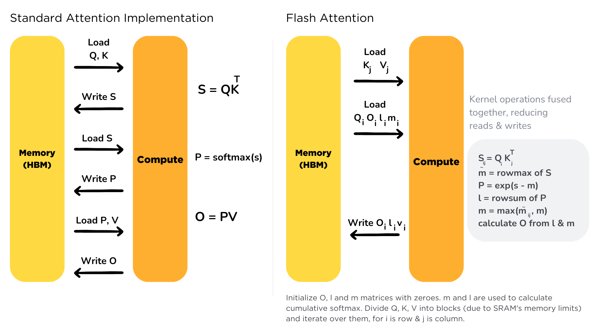

# Flash Attention

* https://huggingface.co/docs/text-generation-inference/conceptual/flash_attention

Scaling the transformer architecture is heavily bottlenecked by the self-attention mechanism, which has quadratic time and memory complexity. Recent developments in accelerator hardware mainly focus on enhancing compute capacities and not memory and transferring data between hardware. This results in attention operation having a memory bottleneck. **Flash Attention** is an attention algorithm used to reduce this problem and scale transformer-based models more efficiently, enabling faster training and inference.
Transformer 架构的扩展性受到自注意力机制的严重限制, 该机制的时间和内存复杂度均为二次方级. 加速器硬件的最新发展主要集中在提升计算能力, 而非内存和硬件间数据传输. 这导致注意力机制的运行受到内存瓶颈的限制. Flash Attention 是一种用于缓解此问题并更高效地扩展基于 Transformer 模型的注意力算法, 从​​而实现更快的训练和推理速度.

Standard attention mechanism uses High Bandwidth Memory (HBM) to store, read and write keys, queries and values. HBM is large in memory, but slow in processing, meanwhile SRAM is smaller in memory, but faster in operations. In the standard attention implementation, the cost of loading and writing keys, queries, and values from HBM is high. It loads keys, queries, and values from HBM to GPU on-chip SRAM, performs a single step of the attention mechanism, writes it back to HBM, and repeats this for every single attention step. Instead, Flash Attention loads keys, queries, and values once, fuses the operations of the attention mechanism, and writes them back.
标准注意力机制使用高带宽内存(HBM)来存储、读取和写入 keys、queries 和 values. HBM 内存占用大, 但处理速度慢; 而 SRAM 内存占用小, 但运算速度快. 在标准注意力机制的实现中, 从 HBM 加载和写入 keys、queries 和 values 的开销很高. 它将 keys、queries 和 values 从 HBM 加载到 GPU 片上 SRAM, 执行注意力机制的单步操作, 然后将其写回 HBM, 并在每个注意力步骤中重复此过程. 而 Flash Attention 则只需加载一次 keys、queries 和 values, 融合注意力机制的操作, 然后将其写回.

It is implemented for supported models. You can check out the complete list of models that support Flash Attention [here](https://github.com/huggingface/text-generation-inference/tree/main/server/text_generation_server/models), for models with flash prefix.
该功能已在支持的 models 上实现. 您可以点击此处查看支持 Flash Attention 的完整 models 列表(机型前缀为 flash).

You can learn more about Flash Attention by reading the paper in this [link](https://arxiv.org/abs/2205.14135).
您可以通过阅读此链接中的论文了解更多关于闪回注意力的信息.
