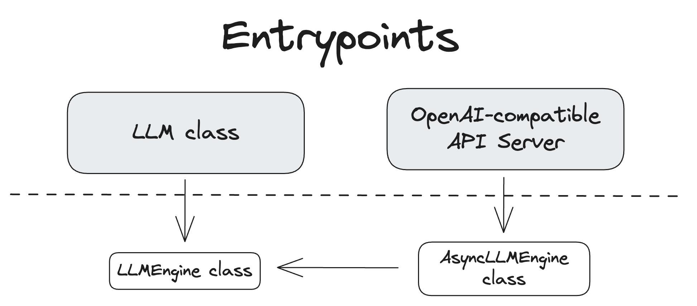
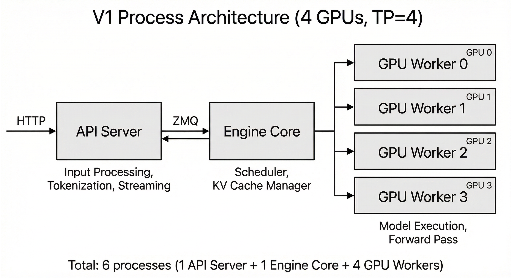
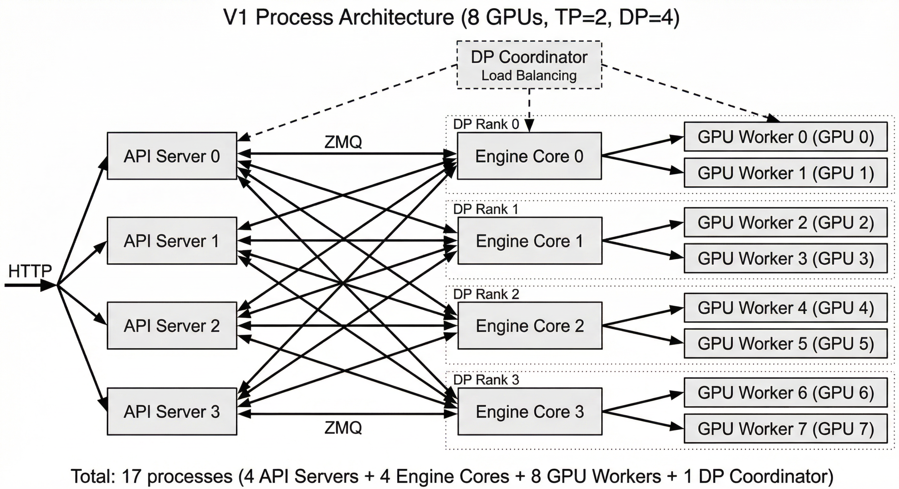
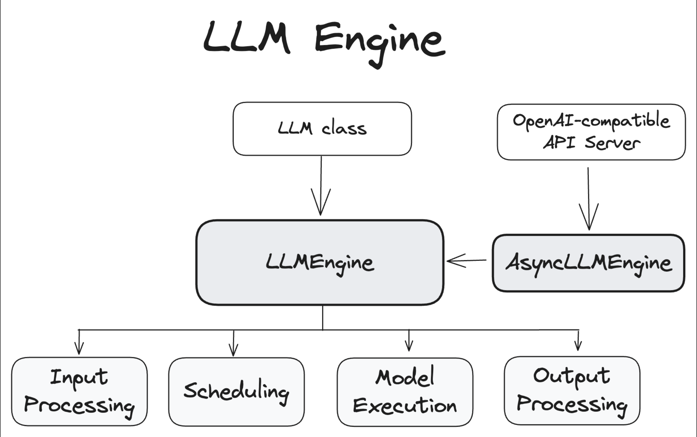
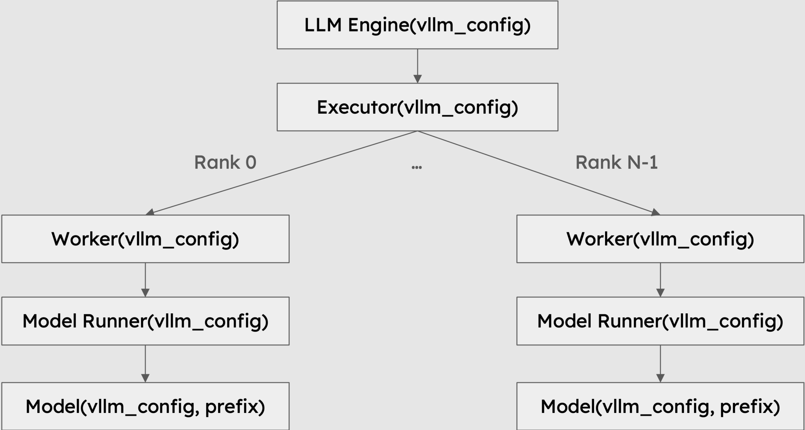

# Architecture Overview

* https://docs.vllm.ai/en/v0.20.0/design/arch_overview/

This document provides an overview of the vLLM architecture.
本文档概述了 vLLM 架构.

## Entrypoints

vLLM provides a number of entrypoints for interacting with the system. The following diagram shows the relationship between them.
vLLM 提供了多个与系统交互的入口点. 下图展示了它们之间的关系.



### LLM Class

The LLM class provides the primary Python interface for doing offline inference, which is interacting with a model without using a separate model inference server.
LLM 类提供了用于进行离线推理的主要 Python 接口, 即在不使用单独的模型推理服务器的情况下与模型进行交互.

Here is a sample of [`LLM`](https://docs.vllm.ai/en/v0.20.0/api/vllm/entrypoints/llm/#vllm.entrypoints.llm.LLM "LLM") class usage:
以下是 `LLM` 类的使用示例:

```python
from vllm import LLM, SamplingParams

# Define a list of input prompts
prompts = [
    "Hello, my name is",
    "The capital of France is",
    "The largest ocean is",
]

# Define sampling parameters
sampling_params = SamplingParams(temperature=0.8, top_p=0.95)

# Initialize the LLM engine with the OPT-125M model
llm = LLM(model="facebook/opt-125m")

# Generate outputs for the input prompts
outputs = llm.generate(prompts, sampling_params)

# Print the generated outputs
for output in outputs:
    prompt = output.prompt
    generated_text = output.outputs[0].text
    print(f"Prompt: {prompt!r}, Generated text: {generated_text!r}")
```

More API details can be found in the [Offline Inference](https://docs.vllm.ai/en/v0.20.0/api/#offline-inference) section of the API docs.
更多 API 详情请参见 API 文档的离线推理部分.

The code for the [`LLM`](https://docs.vllm.ai/en/v0.20.0/api/vllm/entrypoints/llm/#vllm.entrypoints.llm.LLM "LLM") class can be found in [vllm/entrypoints/llm.py](https://github.com/vllm-project/vllm/blob/main/vllm/entrypoints/llm.py).
`LLM` 类的代码可以在以下位置找到: `vllm/entrypoints/llm.py`.

### OpenAI-Compatible API Server
兼容 OpenAI 的 API 服务器

The second primary interface to vLLM is via its OpenAI-compatible API server. This server can be started using the `vllm serve` command.
vLLM 的第二个主要接口是通过其兼容 OpenAI 的 API 服务器. 可以使用 `vllm serve` 命令启动该服务器.

```bash
vllm serve <model>
```

The code for the `vllm` CLI can be found in [vllm/entrypoints/cli/main.py](https://github.com/vllm-project/vllm/blob/main/vllm/entrypoints/cli/main.py).
`vllm` CLI 的代码可以在以下位置找到: `vllm/entrypoints/cli/main.py`.

Sometimes you may see the API server entrypoint used directly instead of via the `vllm` CLI command. For example:
有时您可能会看到直接使用 API 服务器入口点, 而不是通过 `vllm` CLI 命令. 例如:

```bash
python -m vllm.entrypoints.openai.api_server --model <model>
```

> Warning
> `python -m vllm.entrypoints.openai.api_server` is deprecated and may become unsupported in a future release.
> `python -m vllm.entrypoints.openai.api_server` 已弃用, 在未来的版本中可能不再受支持.
>

That code can be found in [vllm/entrypoints/openai/api_server.py](https://github.com/vllm-project/vllm/blob/main/vllm/entrypoints/openai/api_server.py).
该代码可以在以下位置找到: `vllm/entrypoints/openai/api_server.py`.

More details on the API server can be found in the [OpenAI-Compatible Server](https://docs.vllm.ai/en/v0.20.0/serving/openai_compatible_server/) document.
有关 API 服务器的更多详细信息, 请参阅 OpenAI 兼容服务器文档.

## V1 Process Architecture

vLLM V1 uses a multi-process architecture to separate concerns and maximize throughput. Understanding this architecture is important for properly sizing CPU resources in your deployment. The key processes are:
vLLM V1 采用多进程架构来分离关注点并最大化吞吐量. 理解这种架构对于在部署中合理分配 CPU 资源至关重要. 关键进程包括:

### API Server Process

The API server process handles HTTP requests (e.g., the OpenAI-compatible API), performs input processing (tokenization, multi-modal data loading), and streams results back to clients. It communicates with the engine core process(es) via ZMQ sockets.
API 服务器进程处理 HTTP 请求(例如, 与 OpenAI 兼容的 API), 执行输入处理(分词、多模态数据加载), 并将结果流式传输回客户端. 它通过 ZMQ 套接字与引擎核心进程通信.

By default, there is **1 API server process**, but when data parallelism is used, the API server count automatically scales to match the data parallel size. This can also be manually configured with the `--api-server-count` flag. Each API server connects to **all** engine cores via ZMQ in a many-to-many topology, enabling any API server to route requests to any engine core. Each API server process uses multiple CPU threads for media loading (controlled by `VLLM_MEDIA_LOADING_THREAD_COUNT`, default 8).
默认情况下, 只有一个 API 服务器进程; 但启用数据并行时, API 服务器数量会自动调整以匹配数据并行规模. 也可以使用 `--api-server-count` 标志手动配置此值. 每个 API 服务器都通过 ZMQ 以多对多拓扑结构连接到所有引擎核心, 从而使任何 API 服务器都能将请求路由到任何引擎核心. 每个 API 服务器进程使用多个 CPU 线程进行媒体加载(由 `VLLM_MEDIA_LOADING_THREAD_COUNT` 控制, 默认值为 8).

The code can be found in [vllm/entrypoints/openai/api_server.py](https://github.com/vllm-project/vllm/blob/main/vllm/entrypoints/openai/api_server.py) and [vllm/v1/utils.py](https://github.com/vllm-project/vllm/blob/main/vllm/v1/utils.py).
代码可以在以下位置找到: `vllm/entrypoints/openai/api_server.py` 和 `vllm/v1/utils.py`.

### Engine Core Process

The engine core process runs the scheduler, manages KV cache, and coordinates model execution across GPU workers. It runs a busy loop that continuously schedules requests and dispatches work to the GPU workers.
引擎核心进程运行调度器、管理键值缓存, 并协调模型在 GPU 工作节点上的执行. 它运行一个繁忙的循环, 持续调度请求并将工作分派给 GPU 工作节点.

There is **1 engine core process per data parallel rank**. For example, with `--data-parallel-size 4`, there are 4 engine core processes.
每个数据并行进程数对应 1 个引擎核心进程. 例如, 使用 `--data-parallel-size 4` , 则有 4 个引擎核心进程.

The code can be found in [vllm/v1/engine/core.py](https://github.com/vllm-project/vllm/blob/main/vllm/v1/engine/core.py) and [vllm/v1/engine/utils.py](https://github.com/vllm-project/vllm/blob/main/vllm/v1/engine/utils.py).
代码可以在以下位置找到: `vllm/v1/engine/core.py` 和 `vllm/v1/engine/utils.py`.

### GPU Worker Processes

Each GPU is managed by a dedicated worker process. The worker process loads model weights, executes forward passes, and manages GPU memory. Workers communicate with the engine core process that owns them.
每个 GPU 都由一个专用的工作进程管理. 工作进程加载模型权重、执行前向传播并管理 GPU 内存. 工作进程与拥有它们的引擎核心进程通信.

There is **1 worker process per GPU**. The total number of GPU worker processes equals `tensor_parallel_size x pipeline_parallel_size` per engine core.
每个 GPU 有 1 个工作进程. 每个引擎核心的 GPU 工作进程总数等于 `tensor_parallel_size x pipeline_parallel_size`.

The code can be found in [vllm/v1/executor/multiproc_executor.py](https://github.com/vllm-project/vllm/blob/main/vllm/v1/executor/multiproc_executor.py) and [vllm/v1/worker/gpu_worker.py](https://github.com/vllm-project/vllm/blob/main/vllm/v1/worker/gpu_worker.py).
代码可以在以下位置找到: `vllm/v1/executor/multiproc_executor.py` 和 `vllm/v1/worker/gpu_worker.py`.

### DP Coordinator Process (conditional)
DP 协调员流程(有条件)

When using data parallelism (`--data-parallel-size > 1`), an additional coordinator process manages load balancing across DP ranks and coordinates synchronized forward passes for MoE models.
使用数据并行(`--data-parallel-size > 1`)时, 额外的协调器进程管理跨 DP 等级的负载均衡, 并协调 MoE 模型的同步前向传递.

There is **1 DP coordinator process** (only when data parallelism is enabled).
存在 1 个 DP 协调器进程 (仅当启用数据并行时).

The code can be found in [vllm/v1/engine/coordinator.py](https://github.com/vllm-project/vllm/blob/main/vllm/v1/engine/coordinator.py).
代码可以在以下位置找到: `vllm/v1/engine/coordinator.py`.

### Process Count Summary
进程计数汇总

For a deployment with `N` GPUs, `TP` tensor parallel size, `DP` data parallel size, and `A` API server count:
对于具有 `N` GPU、`TP` 张量并行大小、`DP` 数据并行大小和 `A` API 服务器数量的部署:

| Process Type   | Count                        | Notes                                      |
| -------------- | ---------------------------- | ------------------------------------------ |
| API Server     | `A` (default `DP`)           | Handles HTTP requests and input processing |
| Engine Core    | `DP` (default 1)             | Scheduler and KV cache management          |
| GPU Worker     | `N` (= `DP x PP x TP`)       | One per GPU, executes model forward passes |
| DP Coordinator | 1 if `DP > 1`, else 0        | Load balancing across DP ranks             |
| Total          | `A + DP + N` (+ 1 if DP > 1) |                                            |

For example, a typical single-node deployment with 4 GPUs (`vllm serve -tp=4`) has:
例如, 一个典型的具有 4 个 GPU 的单节点部署(`vllm serve -tp=4`)具有:

- 1 API server + 1 engine core + 4 GPU workers = **6 processes**
  1 个 API 服务器 + 1 个引擎核心 + 4 个 GPU 工作进程 = **6 个进程**



A data parallel deployment with 8 GPUs (`vllm serve -tp=2 -dp=4`) has:
使用 8 个 GPU 的数据并行部署(`vllm serve -tp=2 -dp=4`)具有:

- 4 API servers + 4 engine cores + 8 GPU workers + 1 DP coordinator = **17 processes**



For CPU resource sizing recommendations, see [CPU Resources for GPU Deployments](https://docs.vllm.ai/en/v0.20.0/configuration/optimization/#cpu-resources-for-gpu-deployments).

## LLM Engine

The [`LLMEngine`](https://docs.vllm.ai/en/v0.20.0/api/vllm/v1/engine/llm_engine/#vllm.v1.engine.llm_engine.LLMEngine "LLMEngine") and `AsyncLLMEngine` classes are central to the functioning of the vLLM system, handling model inference and asynchronous request processing.
`LLMEngine` 和 `AsyncLLMEngine` 类是 vLLM 系统运行的核心, 用于处理模型推理和异步请求处理.



### LLMEngine

The [`LLMEngine`](https://docs.vllm.ai/en/v0.20.0/api/vllm/v1/engine/llm_engine/#vllm.v1.engine.llm_engine.LLMEngine "LLMEngine") class is the core component of the vLLM engine. It is responsible for receiving requests from clients and generating outputs from the model. The [`LLMEngine`](https://docs.vllm.ai/en/v0.20.0/api/vllm/v1/engine/llm_engine/#vllm.v1.engine.llm_engine.LLMEngine "LLMEngine") includes input processing, model execution (possibly distributed across multiple hosts and/or GPUs), scheduling, and output processing.
`LLMEngine` 类是 vLLM 引擎的核心组件. 它负责接收来自客户端的请求并生成模型的输出 `LLMEngine` 包括输入处理、模型执行(可能分布在多个主机和/或 GPU 上)、调度和输出处理.

- **Input Processing**: Handles tokenization of input text using the specified tokenizer.
  输入处理: 使用指定的分词器处理输入文本的分词.

- **Scheduling**: Chooses which requests are processed in each step.
  调度: 选择在每个步骤中处理哪些请求.

- **Model Execution**: Manages the execution of the language model, including distributed execution across multiple GPUs.
  模型执行: 管理语言模型的执行, 包括跨多个 GPU 的分布式执行.

- **Output Processing**: Processes the outputs generated by the model, decoding the token IDs from a language model into human-readable text.
  输出处理: 处理模型生成的输出, 将语言模型中的标记 ID 解码为人类可读的文本.

The code for [`LLMEngine`](https://docs.vllm.ai/en/v0.20.0/api/vllm/v1/engine/llm_engine/#vllm.v1.engine.llm_engine.LLMEngine "LLMEngine") can be found in [vllm/engine/llm_engine.py](https://github.com/vllm-project/vllm/blob/main/vllm/engine/llm_engine.py).
`LLMEngine` 的代码可以在以下位置找到: `vllm/engine/llm_engine.py`.

### AsyncLLMEngine
异步 LLM 引擎

The `AsyncLLMEngine` class is an asynchronous wrapper for the [`LLMEngine`](https://docs.vllm.ai/en/v0.20.0/api/vllm/v1/engine/llm_engine/#vllm.v1.engine.llm_engine.LLMEngine "LLMEngine") class. It uses `asyncio` to create a background loop that continuously processes incoming requests. The `AsyncLLMEngine` is designed for online serving, where it can handle multiple concurrent requests and stream outputs to clients.
`AsyncLLMEngine` 类是 `LLMEngine` 类的异步包装器. 它使用 `asyncio` 创建一个后台循环, 持续处理传入的请求 `AsyncLLMEngine` 专为在线服务而设计, 能够处理多个并发请求并将输出流式传输给客户端.

The OpenAI-compatible API server uses the `AsyncLLMEngine`. There is also a demo API server that serves as a simpler example in [vllm/entrypoints/api_server.py](https://github.com/vllm-project/vllm/blob/main/vllm/entrypoints/api_server.py).
兼容 OpenAI 的 API 服务器使用 `AsyncLLMEngine`. 此外, 还有一个演示 API 服务器, 可作为更简单的示例. `vllm/entrypoints/api_server.py`.

The code for `AsyncLLMEngine` can be found in [vllm/engine/async_llm_engine.py](https://github.com/vllm-project/vllm/blob/main/vllm/engine/async_llm_engine.py).
`AsyncLLMEngine` 的代码可以在以下位置找到: `vllm/engine/async_llm_engine.py`.

## Worker

A worker is a process that runs the model inference. vLLM follows the common practice of using one process to control one accelerator device, such as GPUs. For example, if we use tensor parallelism of size 2 and pipeline parallelism of size 2, we will have 4 workers in total. Workers are identified by their `rank` and `local_rank`. `rank` is used for global orchestration, while `local_rank` is mainly used for assigning the accelerator device and accessing local resources such as the file system and shared memory.
工作进程是运行模型推理的进程. vLLM 遵循常见的做法, 即使用一个进程控制一个加速设备, 例如 GPU. 例如, 如果我们使用大小为 2 的张量并行和大小为 2 的流水线并行, 则总共会有 4 个工作进程. 工作进程通过其 `rank` 和 `local_rank` 进行标识. rank 用于全局编排, 而 `local_rank` 主要用于分配加速设备以及访问本地资源 `rank` 例如文件系统和共享内存.

## Model Runner

Every worker has one model runner object, responsible for loading and running the model. Much of the model execution logic resides here, such as preparing input tensors and capturing cudagraphs.
每个工作进程都有一个模型运行器对象, 负责加载和运行模型. 模型执行的大部分逻辑都位于此处, 例如准备输入张量和捕获 CUDA 图.

## Model

Every model runner object has one model object, which is the actual `torch.nn.Module` instance. See [huggingface_integration](https://docs.vllm.ai/en/v0.20.0/design/huggingface_integration/) for how various configurations affect the class we ultimately get.
每个模型运行器对象都包含一个模型对象, 即实际的 `torch.nn.Module` 实例. 有关各种配置如何影响最终得到的类, 请参阅 huggingface_integration.

## Class Hierarchy
类层次结构

The following figure shows the class hierarchy of vLLM:
下图显示了 vLLM 的类层次结构:



There are several important design choices behind this class hierarchy:
这种类层次结构背后有几个重要的设计选择:

1. **Extensibility**: All classes in the hierarchy accept a configuration object containing all the necessary information. The [VllmConfig](https://github.com/vllm-project/vllm/blob/d1c6799b8870e513bf4f2305cbf6cda9fc3d773b/vllm/config.py#L2036) class is the main configuration object that is passed around. The class hierarchy is quite deep, and every class needs to read the configuration it is interested in. By encapsulating all configurations in one object, we can easily pass the configuration object around and access the configuration we need. Suppose we want to add a new feature (this is often the case given how fast the field of LLM inference is evolving) that only touches the model runner. We will have to add a new configuration option in the [`VllmConfig`](https://docs.vllm.ai/en/v0.20.0/api/vllm/config/vllm/#vllm.config.vllm.VllmConfig "VllmConfig") class. Since we pass the whole config object around, we only need to add the configuration option to the [`VllmConfig`](https://docs.vllm.ai/en/v0.20.0/api/vllm/config/vllm/#vllm.config.vllm.VllmConfig "VllmConfig") class, and the model runner can access it directly. We don't need to change the constructor of the engine, worker, or model class to pass the new configuration option.
   可扩展性: 层次结构中的所有类都接受一个包含所有必要信息的配置对象. `VllmConfig` 类是传递的主要配置对象. 由于类层次结构相当深, 每个类都需要读取它感兴趣的配置. 通过将所有配置封装在一个对象中, 我们可以轻松地传递配置对象并访问所需的配置. 假设我们要添加一个仅涉及模型运行器的新功能(鉴于 LLM 推理领域的快速发展, 这种情况很常见), 则需要在 `VllmConfig` 类中添加一个新的配置选项. 由于我们传递的是整个配置对象, 因此只需将配置选项添加到 `VllmConfig` 类, 模型运行器即可直接访问它. 我们无需更改引擎、工作进程或模型类的构造函数来传递新的配置选项.

2. **Uniformity**: The model runner needs a unified interface to create and initialize the model. vLLM supports more than 50 types of popular open-source models. Each model has its own initialization logic. If the constructor signature varies with models, the model runner does not know how to call the constructor accordingly, without complicated and error-prone inspection logic. By making the constructor of the model class uniform, the model runner can easily create and initialize the model without knowing the specific model type. This is also useful for composing models. Vision-language models often consist of a vision model and a language model. By making the constructor uniform, we can easily create a vision model and a language model and compose them into a vision-language model.
   统一性: 模型运行器需要一个统一的接口来创建和初始化模型. vLLM 支持 50 多种流行的开源模型. 每个模型都有自己的初始化逻辑. 如果构造函数签名因模型而异, 模型运行器就无法在不进行复杂且容易出错的检查逻辑的情况下调用相应的构造函数. 通过统一模型类的构造函数, 模型运行器无需了解具体的模型类型即可轻松创建和初始化模型. 这对于模型组合也很有用. 视觉语言模型通常由视觉模型和语言模型组成. 通过统一构造函数, 我们可以轻松创建视觉模型和语言模型, 并将它们组合成一个视觉语言模型.

> Note
> To support this change, all vLLM models' signatures have been updated to:
> 为支持此项变更, 所有 vLLM 模型的签名均已更新为:
>

```python
def __init__(self, *, vllm_config: VllmConfig, prefix: str = ""):
```

> To avoid accidentally passing incorrect arguments, the constructor is now keyword-only. This ensures that the constructor will raise an error if old configurations are passed. vLLM developers have already made this change for all models within vLLM. For out-of-tree registered models, developers need to update their models, for example by adding shim code to adapt the old constructor signature to the new one:
> 为避免意外传递错误参数, 构造函数现在仅接受关键字参数. 这样可以确保如果传递了旧配置, 构造函数会引发错误. vLLM 开发人员已对 vLLM 中的所有模型进行了此更改. 对于外部注册的模型, 开发人员需要更新其模型, 例如, 通过添加 shim 代码来将旧的构造函数签名适配到新的签名:
>

```python
class MyOldModel(nn.Module):
    def __init__(
        self,
        config,
        cache_config: Optional[CacheConfig] = None,
        quant_config: Optional[QuantizationConfig] = None,
        lora_config: Optional[LoRAConfig] = None,
        prefix: str = "",
    ) -> None:
        ...

from vllm.config import VllmConfig
class MyNewModel(MyOldModel):
    def __init__(self, *, vllm_config: VllmConfig, prefix: str = ""):
        config = vllm_config.model_config.hf_config
        cache_config = vllm_config.cache_config
        quant_config = vllm_config.quant_config
        lora_config = vllm_config.lora_config
        super().__init__(config, cache_config, quant_config, lora_config, prefix)

from packaging import version
if version.parse(__version__) >= version.parse("0.6.4"):
    MyModel = MyNewModel
else:
    MyModel = MyOldModel
```

> This way, the model can work with both old and new versions of vLLM.
> 这样, 该模型就可以与旧版本和新版本的 vLLM 一起使用.
>

3. **Sharding and Quantization at Initialization**: Certain features require changing the model weights. For example, tensor parallelism needs to shard the model weights, and quantization needs to quantize the model weights. There are two possible ways to implement this feature. One way is to change the model weights after the model is initialized. The other way is to change the model weights during the model initialization. vLLM chooses the latter. The first approach is not scalable to large models. Suppose we want to run a 405B model (with roughly 810GB weights) with 16 H100 80GB GPUs. Ideally, every GPU should only load 50GB weights. If we change the model weights after the model is initialized, we need to load the full 810GB weights to every GPU and then shard the weights, leading to a huge memory overhead. Instead, if we shard the weights during the model initialization, every layer will only create a shard of the weights it needs, leading to a much smaller memory overhead. The same idea applies to quantization. Note that we also add an additional argument `prefix` to the model's constructor so that the model can initialize itself differently based on the prefix. This is useful for non-uniform quantization, where different parts of the model are quantized differently. The `prefix` is usually an empty string for the top-level model and a string like `"vision"` or `"language"` for the sub-models. In general, it matches the name of the module's state dict in the checkpoint file.
   初始化时的分片和量化: 某些功能需要更改模型权重. 例如, 张量并行需要对模型权重进行分片, 而量化需要对模型权重进行量化. 实现此功能有两种方法. 一种方法是在模型初始化后更改模型权重. 另一种方法是在模型初始化期间更改模型权重. vLLM 选择后者. 第一种方法不适用于大型模型. 假设我们要使用 16 个 80GB 的 H100 GPU 运行一个 405B 的模型(权重约为 810GB). 理想情况下, 每个 GPU 应该只加载 50GB 的权重. 如果我们在模型初始化后更改模型权重, 则需要将全部 810GB 的权重加载到每个 GPU, 然后再进行分片, 这将导致巨大的内存开销. 相反, 如果我们在模型初始化期间对权重进行分片, 则每一层只会创建其所需的权重分片, 从而显著降低内存开销. 同样的原理也适用于量化. 请注意, 我们还在模型构造函数中添加了一个额外的参数 `prefix` 以便模型可以根据该前缀以不同的方式初始化自身. 这对于非均匀量化非常有用, 因为模型的不同部分需要以不同的方式量化. 对于顶层模型, 该 `prefix` 通常为空字符串; 对于子模型, 前缀则为类似 `"vision"` 或 `"language"` 字符串. 一般来说, 它与检查点文件中模块状态字典的名称相匹配.

One disadvantage of this design is that it is hard to write unit tests for individual components in vLLM because every component needs to be initialized by a complete config object. We solve this problem by providing a default initialization function that creates a default config object with all fields set to `None`. If the component we want to test only cares about a few fields in the config object, we can create a default config object and set the fields we care about. This way, we can test the component in isolation. Note that many tests in vLLM are end-to-end tests that test the whole system, so this is not a big problem.
这种设计的一个缺点是, 由于每个组件都需要使用完整的配置对象进行初始化, 因此很难为 vLLM 中的各个组件编写单元测试. 我们通过提供一个默认初始化函数来解决这个问题, 该函数会创建一个默认配置对象, 并将所有字段都设置为 `None` . 如果我们要测试的组件只关心配置对象中的几个字段, 我们可以创建一个默认配置对象, 并设置我们需要的字段. 这样, 我们就可以单独测试该组件. 需要注意的是, vLLM 中的许多测试都是端到端测试, 会测试整个系统, 因此这并不是一个大问题.

In summary, the complete config object [`VllmConfig`](https://docs.vllm.ai/en/v0.20.0/api/vllm/config/vllm/#vllm.config.vllm.VllmConfig "VllmConfig") can be treated as an engine-level global state that is shared among all vLLM classes.
总而言之, 完整的配置对象 `VllmConfig` 可以被视为引擎级别的全局状态, 在所有 vLLM 类之间共享.
