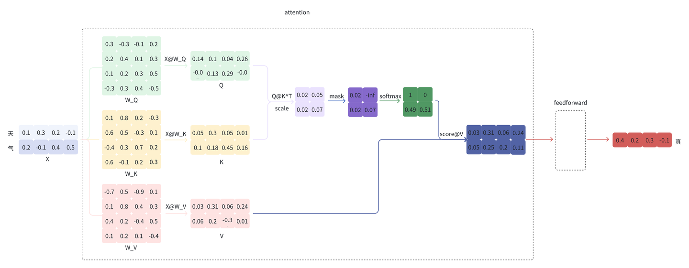
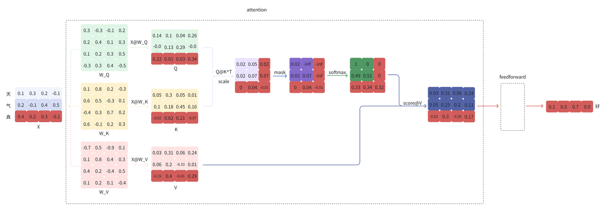
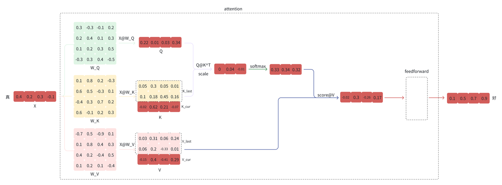

# LLM 推理优化之 KV Cache

* https://zhuanlan.zhihu.com/p/673923443

[大模型推理加速: 看图学 KV Cache](https://zhuanlan.zhihu.com/p/662498827) 这篇文章很好地介绍了 KV Cache 的原理, 本文会辅以代码介绍 KV Cache.

本文先介绍在不使用 KV Cache 的情况下是如何一步步预测下一个 token 的, 然后介绍 KV Cache 是如何做的.

## 不使用 KV Cache

给定"天气", 模型会逐个预测剩下的字, 假设接下来预测的两个字为"真好".

注意: 下面的示例图只给出了和 KV Cache 相关的细节.

- 第一步会预测"真"



下面是上图计算流程的代码实现:

```python
import torch
import torch.nn.functional as F

X = torch.tensor([[0.1, 0.3, 0.2, -0.1], [0.2, -0.1, 0.4, 0.5]])
W_Q = torch.tensor(
    [
        [0.3, -0.3, -0.1, 0.2],
        [0.2, 0.4, 0.1, 0.3],
        [0.1, 0.2, 0.3, 0.5],
        [-0.3, 0.3, 0.4, -0.5],
    ]
)
W_K = torch.tensor(
    [
        [0.1, 0.8, 0.2, -0.3],
        [0.6, 0.5, -0.3, 0.1],
        [-0.4, 0.3, 0.7, 0.2],
        [0.6, -0.1, 0.2, 0.3],
    ]
)
W_V = torch.tensor(
    [
        [-0.7, 0.5, -0.9, 0.1],
        [0.1, 0.8, 0.4, 0.3],
        [0.4, 0.2, -0.4, 0.5],
        [0.1, 0.2, 0.1, -0.4],
    ]
)
Q = torch.matmul(X, W_Q)
K = torch.matmul(X, W_K)
V = torch.matmul(X, W_V)
scores = torch.matmul(Q, K.T) / 2
scores += torch.tensor(
    [
        [0, float("-inf")],
        [0, 0],
    ]
)
scores = F.softmax(scores, dim=-1)
output = torch.matmul(scores, V)
```

output 再经过 feedforward 等步骤最终得到预测的 token "真";

- 第二步会将"真"拼接到"天气"的后面, 即新的输入为"天气真", 再预测"好"



```python
X = torch.tensor([[0.1, 0.3, 0.2, -0.1], [0.2, -0.1, 0.4, 0.5], [0.4, 0.2, 0.3, -0.1]])
Q = torch.matmul(X, W_Q)
K = torch.matmul(X, W_K)
V = torch.matmul(X, W_V)
scores = torch.matmul(Q, K.T) / 2
scores += torch.tensor(
    [[0, float("-inf"), float("-inf")], [0, 0, float("-inf")], [0, 0, 0]]
)
scores = F.softmax(scores, dim=-1)
output = torch.matmul(scores, V)
```

同样的, output 再经过 feedforward 等步骤最终得到预测的 token "好";

## 使用 KV Cache

观察上面的计算过程, 可以看到, 在第二步的预测中, "好"的预测只和"真"以及完整的 K, V 有关.
于是, KV Cache 的想法就很直观了, 缓存上一轮的 K, V, 即可达到减少计算, 提速的效果.
从第二步开始时, 只需输入当前位置的 token, 得到当前位置对应的 K_cur, V_cur, 再拼接上一步缓存的 K_last, V_last 得到完整的 K, V, 即可完成下一个 token 的预测. 下图是在上图的基础上只保留和预测"好"相关的数据:


