# vLLM(一) PagedAttention 算法

* https://zhuanlan.zhihu.com/p/680153425

vLLM 是一个 LLM (Large Lanuage Model) 推理和部署服务库, 它结合 iterative-level schedule (continuous batching) 和 PagedAttention 注意力算法以提高服务的吞吐量. 前者(iterative-level schedule)以单轮迭代的方式对用户的请求进行处理, 即 LLM 生成一个 token 后会重新调度并挑选要下一轮要处理的请求. 后者(PagedAttention)受操作系统虚拟内存和分页思想启发, 将原本连续的 KV cache 存储在不连续的空间, 以避免 KV cache 带来的显存浪费.

本文主要介绍 PagedAttention 算法. 在开始介绍 PagedAttention 前, 先对文中涉及的个别名词进行解释:

- 请求(request): 指用户的请求, 生命周期为系统接收到并完成处理, 请求包括输入(prompt)、超参(例如 top-k)以及输出(output)
- prompt: 指请求的输入, 例如用户发起一个请求, 其输入为 "Alan Turing is a computer scientist"
- 序列(sequence): 输入加输出为一个完整的序列
- 内存空间: 内存空间有连续和不连续之分. 另外, 本文不严格区分内存空间和显存空间, 统一用内存空间
- KV cache: 一种缓存之前 token attention 计算过程的 key value 值以加速后续 token attention 计算的加速技巧
- token: 是 LLM 处理的最小单位. 本文为了简化, 一个单词对应一个 token.

## 介绍

论文作者受操作系统虚拟内存和分页思想(virtual memory and paging)的启发, 提出了 PagedAttention, 旨在解决 LLM (Large Language Model) KV cache 不连续导致的利用率低下问题. 得益于 PagedAttention, 论文作者开发的 vLLM 推理服务框架解决了 KV cache 利用率低下问题进而显著提升了 LLM 推理服务的吞吐量.
现有推理系统的 KV cache 利用率低下表现在两方面:

- 提前分配过大的空间导致部分空间没有被使用: 需根据请求的可能最大长度(prompt + output)预分配连续的空间, 产生内部碎片(internal fragmentation, 已经分配给请求但未被利用的空间)以及外部碎片(external fragmentation, 过小而无法分配给其他请求)

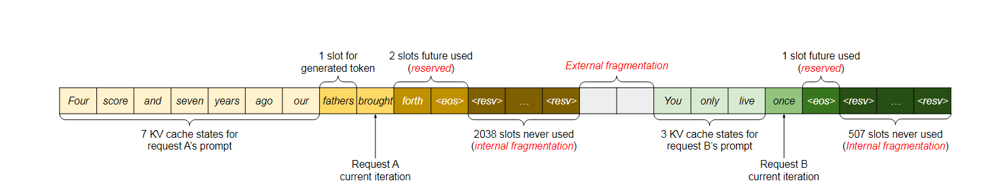

图 1 展示了现有推理系统对于两个请求的内存分配情况. 推理系统为请求 A 预分配了 2048 个 slot(每个 slot 用于存放 1 个 token 的 KV 值), 为请求 B 预分配了 512 个 slot. 预分配策略带来三处内存浪费: reserved slot 虽然将来会被用到(2 slots future used), 但当前轮次(当前预测的下一个 token 为 brought)不会用到, 导致其他 request 不能利用这些空间; 内部碎片只有完成请求后才能知道(因为并不能提前预知这些空间不会被用到, 换句话说, LLM 会产生多长的输出并不能被预知), 同样导致其他 request 不能利用这些空间; 外部碎片是在预分配时就确认不会被使用, 图 1 中产生外部碎片的原因是请求 A 只需分配 2048 个 slot, 但实际有 2050 个连续的 slot, 导致剩下的 2 个 slot难以再分配给其他请求.

- 无法利用共享空间: 有些解码算法(decoding alogorithm)会为一个请求生成多个输出, 例如 parallel sampling 和 [beam search](https://zhida.zhihu.com/search?content_id=239275124&content_type=Article&match_order=1&q=beam+search&zhida_source=entity), 而现有推理系统无法利用这个特点将同一 prompt 存储在同一块空间. 图 2 是 parallel sampling 的示意图.

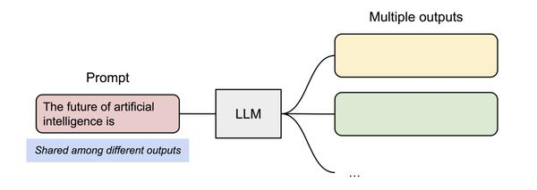

究其原因, KV cache 利用率低下是现有推理系统需将 KV cache 存储在连续的内存空间导致的, 而内存空间的连续性正是深度学习框架处理张量所必须的.

基于以上观察, 论文作者提出 PagedAttention, 用以解决 KV cache 需存储在连续内存空间的问题, 它的做法是预先分配一大块显存, 并将大块显存划分成较小的块(block), 每块可以存放固定数量 token 的 key 和 value 值, 为请求的 KV cache 分配空间时按需分配, 且无需存储在连续的内存空间. 它将大块显存划分成小块并按需分配的做法有效解决了内部碎片和外部碎片, 因为每块只存放固定数量(block size, 这个值默认是 16)的 token, 对于每个 request, 最多只会浪费 block size-1 个 token 所需的空间. 另外, 由于它以块的方式存储 KV cache, 因此它天然能够以块的粒度实现显存的共享.

## 原理

下面将以实际的例子介绍 PagedAttention 的工作原理.

在初始化阶段, 它预先分配一大块显存并划分成小块, 即图 3 中的 Physical KV cache blocks(真正存储 KV cache 的空间, 每个块称为 Physical block, 可以存储 block_size 个 token 所需的 KV cache), 并创建块表(Block table)用于将 Logical KV cache blocks(每个块称为 Logical block, 用于存储 token 值) 映射到 Physical KV cache blocks.

1. 预分配显存并分块以及创建块表

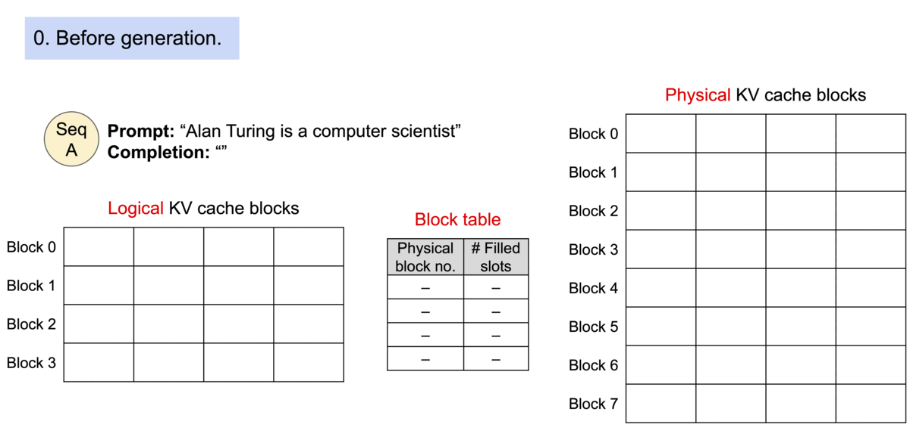

假设接收到的请求的 prompt 是 "Alan Turing is a computer scientist", 它为该请求分配 Logical KV block 以及 Physical KV cache block, 并通过块表将两者关联在一起. 如图 4 所示, "Alan Turing is a" 逻辑上存储在 Logical KV cache blocks 中的 Block 0, 实际上是被存储在 Physical KV cache block 的 Block 7, 两者通过块表关联在一起, 其中 Filled slots 表示该 块已存储的 token 数.

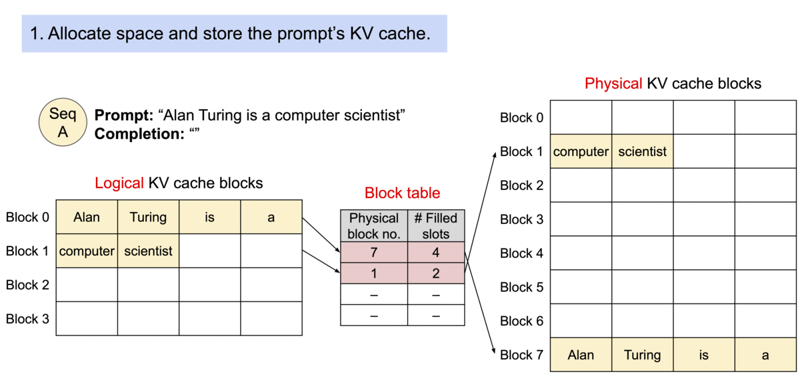

接下来, 开始生成第一个 token "and", 它存储在 Logical KV cache blocks 的 Block 1, 实际存储在 Physical KV cache block 的 Block 1, 同时更新 Filled slots 为 3, 如图 5 所示.

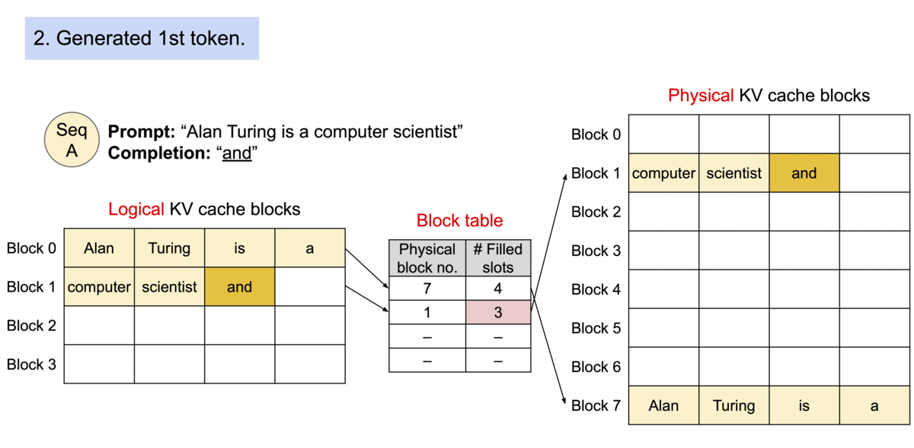

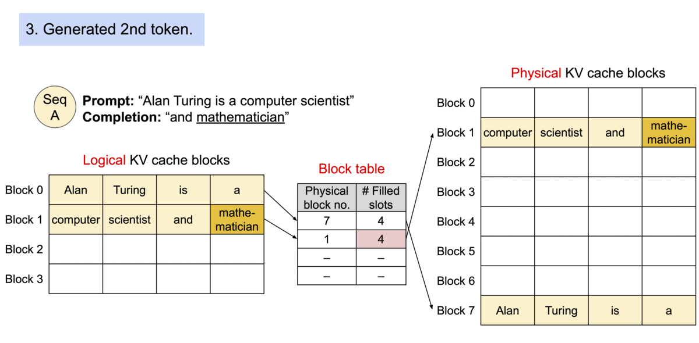

生成第二个 token "mathematician", 如图 6 所示.

生成第三个 token "renowed", 由于 Block 1 已经满了(已经存了 4 个 token), 需要新分配一个块用来存放新 token "renowed".

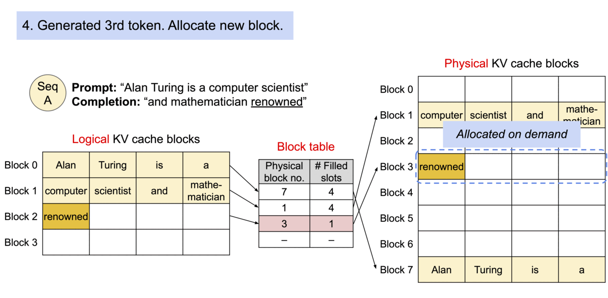

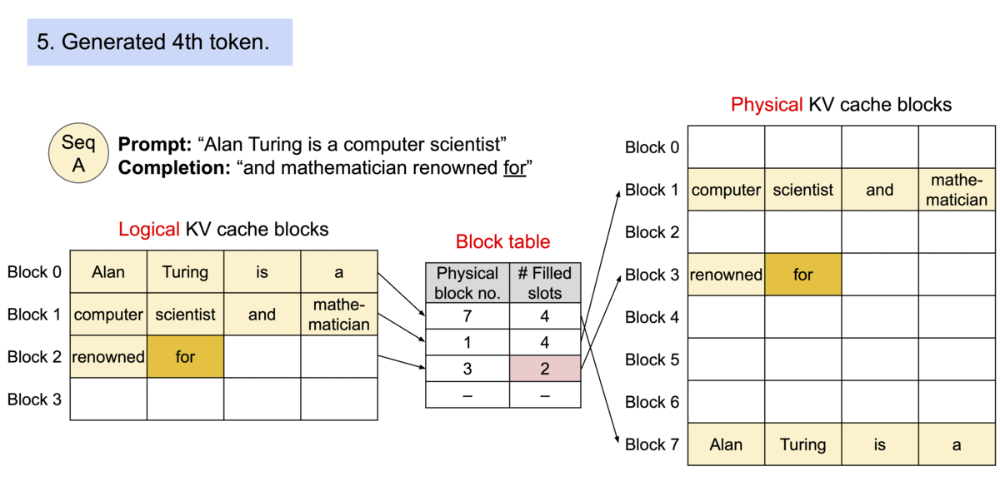

同样生成第四个 token "for".

从上面的介绍中可以看到, PagedAttention 可以很好地解决现有推理系统 KV cache 产生的内外部碎片.

接下来, 我们继续看看它是如何解决 parallel sampling、beam search 以及 shared prompt 涉及的共享问题.

- parallel sampling

parallel sampling 为一个 prompt 提供多个输出, 便于用户选择其中一个.

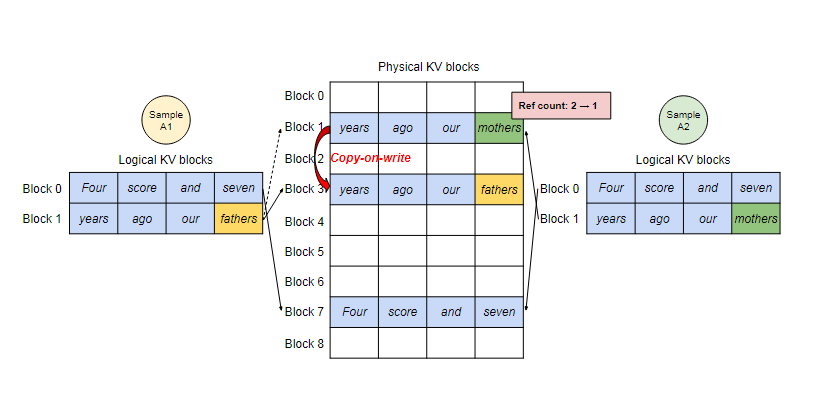

如图 10 所示, 假设样本 A1 和样本 A2 来自于同一个 promot 的不同输出, 其 prompt 为 "Four score and seven years ago our", 它们的 Logical KV blocks 分别为各自的 Block 0 和 Block1, 而 PagedAttention 只会为它们存储一份共享的 Physical KV blocks, 由于一个 Physical block 可能会对应多个 Logical KV block, 所以需要为每个 Physical block 引入 reference count, 用于记录该 block 对应的 Logical block 数量. PagedAttention 采用写入时复制(copy-on-write)机制来处理共享问题, 即只有发生写入操作时才产生拷贝操作. 当 parallel sampling 开始生成下一个 token 时, 假设下一个 token 分别为 "fathers" 和 "mothers", 样本 A1 将 "fathers" 写入到最后一个 Logical block 1 后, 正打算将 "fathers" 对应的 KV cache 写入到 Physical block 1 时, PagedAttention 意识到 Physical block 1 的 reference count 为 2, 因此它需先将 Physical Block 1 的内容拷贝到新的 Block 3 并将 Block 1 的 reference count 减 1, 再将 "fathers" 对应的 KV cache 写入到 Physical block 3. 此时, 样本 A2 准备将 "mothers" 写入到 Physical Block 1, 发现 reference count 为 1, 所以可以直接写入.

- beam search

beam search 的原理是每一次迭代只保留 top-k 个候选序列.

PagedAttention 对 beam search 的处理与 parallel sampling 不同, 它不仅会共享 prompt 的 KV cache, 还会动态共享候选块.

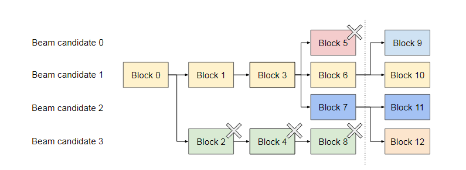

如图 11 所示, 在虚线前, 每个候选序列都使用了 4 个完整的块, 所有的候选序列都共享了 Block 0, 候选序列 0、1、2 共享了 Block 1, 候选序列 3 单独占有 Block 2. 在虚线后, 由于候选序列 3 已不再需要 Block 2、4、8, 因此它们均被释放.

- shared prompt

通常 LLM 都会为用户提供 [system prompt](https://zhida.zhihu.com/search?content_id=239275124&content_type=Article&match_order=1&q=system+prompt&zhida_source=entity), 用以对任务的描述. 如图 12 所示, 序列 A 和 B 有同样的 system prompt, 因此可以提前计算system prompt 的 KV 值并缓存下来作为共享部分.

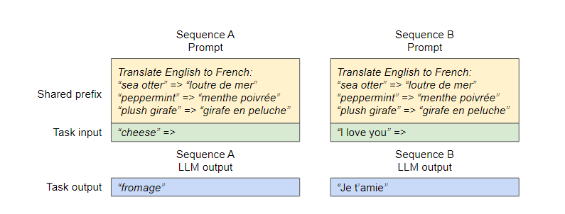

至此, 对 PagedAttention 算法的介绍就暂告一段落了.

阅读完本篇文章, 相信大家心里还有很多疑问, 例如 vLLM 的完整工作流程是怎样的, vLLM 是如何处理 batch 请求的(continuous batching), vLLM 的实现细节是怎样的, 这些疑问我将在后续的文章一一解读, 欢迎大家关注.
